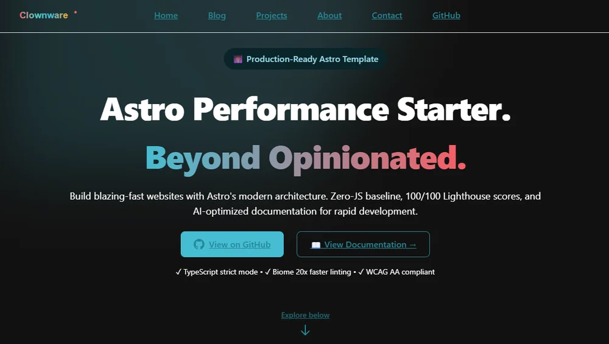

# Astro Performance Starter

**Zero-JS baseline • 95+ Lighthouse scores • Built for speed**

[](https://github.com/clownware/astro-performance-starter/actions/workflows/ci.yml)
[](./LICENSE.txt)
[](https://nodejs.org/)
[](#-performance-budgets)

[Quick Start](#-quick-start) • [Documentation](#-documentation) • [Contributing](#-contributing)

---



## Why This Starter?

Most Astro templates sacrifice performance for features. This one delivers **95+ Lighthouse scores** without the bloat.

- **Performance-first** — < 90KB JS, < 15KB CSS (gzipped) out of the box
- **Modern stack** — Astro 5.x + TypeScript 5.x + Tailwind 3.x + Biome 2.x
- **Accessible** — WCAG AA compliance via semantic HTML, ARIA labels, and validated contrast ratios
- **Solo dev optimized** — Build portfolios and client sites fast
- **AI-ready** — Rich context for AI coding assistants in `docs/ai-context/`

## ⚡ Quick Start

### Use as a GitHub template

Click **Use this template** on GitHub, then:

```bash
git clone https://github.com/YOUR_USERNAME/YOUR_REPO.git
cd YOUR_REPO
pnpm install
pnpm run dev
```

### Or scaffold with the Astro CLI

```bash
pnpm create astro@latest my-site -- --template clownware/astro-performance-starter
cd my-site
pnpm run dev
```

Open **<http://localhost:4321/>** — you're up and running.

> **First build?** Token compilation happens automatically on first `dev` or `build` command.
>
> **No pnpm?** Run `corepack enable` first, or see [troubleshooting](./docs/getting-started/onboarding.md#troubleshooting).

## 🛠️ Personalization

After cloning, update these files to make the template yours:

| File | What to change |
|------|---------------|
| `src/config.ts` | Site title, author, GitHub URL, docs URL, social links |
| `astro.config.mjs` | `site` URL for your deployment |
| `src/content/navigation/header.json` | Navigation links and GitHub URL |
| `public/logo.svg` | Your logo / wordmark |
| `tokens/base.json` | Brand colors |
| `package.json` | `name`, `description`, `repository` |

## ✨ What's Inside

- **Astro** 5.x with zero-JS by default (islands when needed)
- **TypeScript** 5.x in strict mode for type safety
- **Tailwind CSS** 3.x with design token system
- **Biome** 2.x for formatting and linting (20x faster than ESLint+Prettier)
- **Node.js** 24.x (locked via `.nvmrc`)
- **pnpm** 10.x (enforced via `engine-strict`)
- Atomic design structure in `src/components/`
- Content collections with MDX support
- GitHub Actions CI/CD (build, lint, type-check, security audit)
- Pre-commit hooks for code quality
- E2E tests with Playwright, unit tests with Vitest

## 📚 Documentation

Everything you need to customize and extend lives in `docs/`:

- **[Onboarding Guide](./docs/getting-started/onboarding.md)** — Detailed setup and concepts
- **[Launch Demo](./docs/getting-started/launch-demo.md)** — Get running in 15 minutes
- **[Quick Deploy](./docs/getting-started/quick-deploy.md)** — Ship to production in under an hour
- **[Implementation Roadmap](./docs/README.md#implementation-roadmap)** — Phased development guide
- **[AI Context Guides](./docs/ai-context/)** — Optimized for AI assistants

> The `docs/` folder contains extensive reference material. These files never ship to production.

## 🎨 Progressive Implementation

One path, three natural stopping points:

- **Foundation (Phases 0–4)** — Working site skeleton with design system, content schemas, and CI pipeline — pre-configured in template
- **Build (Phases 5–8)** — Components, pages, content, and QA — scope each phase to Essential / Recommended / Advanced
- **Polish (Phases 9–12)** — Performance budgets, deployment, documentation, monitoring — stop when goals are met

See the **[Implementation Guide](./docs/README.md#implementation-roadmap)** for details.

## 🤖 AI Context Layer

This template includes structured documentation designed for AI coding assistants. The `docs/` directory serves as both human-readable reference and filesystem-readable context for tools like Windsurf, Cursor, and GitHub Copilot.

- **Entry point**: `docs/ai-context/INDEX.md` — project overview, constraints, and navigation
- **Architectural constraints**: `docs/adr/` — every accepted ADR is a rule AI must respect
- **Performance limits**: Budgets and guardrails checked before adding dependencies
- **Zero config**: No MCP server, no API — just well-structured markdown that any AI can read

## 🔧 Key Commands

```bash
pnpm run dev              # Start dev server
pnpm run build            # Production build
pnpm run preview          # Serve already-built dist/ locally
pnpm run format           # Format with Biome
pnpm run lint             # Lint with Biome
pnpm run quality          # Full quality check (format + lint + type-check)
pnpm run test:unit        # Unit tests (Vitest)
pnpm run test:e2e         # E2E tests (Playwright)
pnpm run tokens:build     # Rebuild design tokens (rarely needed)
```

## 🚀 Performance Budgets

Strict limits enforced via CI:

- **JavaScript**: < 160KB gzipped
- **CSS**: < 50KB uncompressed
- **Lighthouse**: 95+ Performance, 98+ Accessibility

Default starter delivers well under budget: ~90KB JS, ~15KB CSS (gzipped).

## 🤝 Contributing

Contributions welcome! See [CONTRIBUTING.md](./CONTRIBUTING.md) for guidelines.

## 📄 License

Licensed under the [MIT License](./LICENSE.txt).

---

**Status**: Active development • v0.1.0 • [Releases](https://github.com/clownware/astro-performance-starter/releases)
