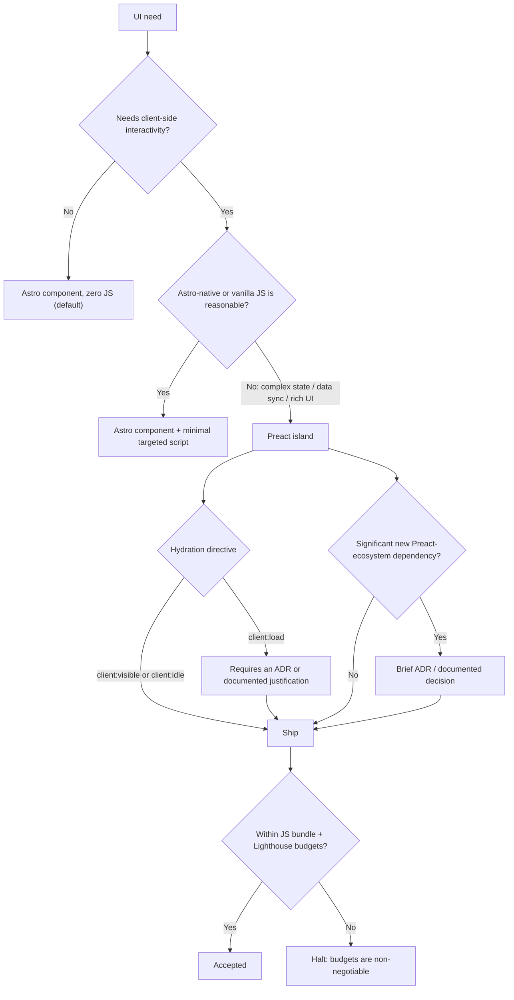

## Status

Accepted

## Context

This Astro starter template prioritizes performance and adheres to a "zero-JS by default" philosophy, as outlined in the Windsurf Project Rules (`docs/ai-context/INDEX.md`). Astro Islands allow for the integration of UI framework components (like Preact, Vue, Svelte) for interactive elements. However, introducing complex client-side JavaScript, especially from rich ecosystems like Preact 10.x, Preact Query, TanStack Router), can significantly impact bundle sizes and page performance if not managed carefully.

The Advanced scope of this starter template may require more complex, interactive UI components where leveraging the Preact ecosystem could offer development velocity or specific functionalities not easily replicated with vanilla JavaScript or simpler Astro components.

This ADR addresses the need for clear guidelines on when and how Preact components, particularly those relying on extensive client-side libraries, can be incorporated.

## Decision Drivers

- **Performance**: Zero-JS by default philosophy must be preserved
- **Bundle Size**: Client-side libraries directly impact Lighthouse scores and Core Web Vitals
- **Developer Velocity**: Some complex interactions are more efficiently built with framework ecosystems
- **Maintainability**: Astro-native solutions are simpler to maintain long-term
- **Scope Differentiation**: Advanced scope projects have different interactivity needs than Essential scope

## Decision

1. **Default to Astro Components & Vanilla JS**: The primary approach for UI development remains Astro components with minimal, targeted client-side JavaScript for interactivity. This aligns with the "Zero-JS by default; Islands only when needed" rule.

2. **Preact Islands for Complex Interactivity (Recommended/Advanced Scope)**: The use of Preact components within Astro Islands is permissible, especially for Recommended and Advanced scope projects, under the following conditions:
    - The required functionality involves significant client-side state management, data fetching/caching, or complex UI interactions that are demonstrably more efficiently or robustly implemented with Preact and its ecosystem libraries (e.g., Preact Query for complex data synchronization, TanStack Router for intricate client-side navigation within an island).
    - A lightweight Astro-native or vanilla JavaScript alternative is not reasonably available or would lead to significantly more complex and less maintainable code.
    - The component is clearly an "island" of interactivity and not an attempt to build a full single-page application (SPA) experience within an Astro page.

3. **`client:load` Directive Requires Justification**: As per Windsurf Rules, any use of `client:load` for an Astro Island (Preact or otherwise) must be justified via an ADR or clear documentation, especially if it introduces substantial JavaScript. Prefer `client:idle` or `client:visible` where possible.

4. **Performance Budgets are Non-Negotiable**: All Preact Islands and their associated libraries must adhere to the project's strict performance budgets (JS bundle size, Lighthouse scores). The introduction of a Preact Island must not cause these budgets to be exceeded.

5. **ADR for Significant Preact Ecosystem Dependencies**: If a Preact Island introduces a significant new Preact ecosystem dependency (e.g., a state management library, a routing library, a large data grid library), a brief ADR or a documented decision within the relevant component's documentation should justify its inclusion, outlining why it's necessary and how its performance impact is managed.

### Decision path

The five points above collapse into one escalation path. Every step that adds client-side JavaScript must still clear the performance budgets (point 4).

## Consequences

### Positive

- Allows Recommended/Advanced scope projects to leverage powerful Preact ecosystem libraries for complex UIs where appropriate
- Provides a structured way to deviate from the zero-JS default when necessary
- Clear escalation path: Astro-native → vanilla JS → Preact island

### Negative

- Risk of increased client-side JavaScript if not carefully managed
- Potential for hydration issues or compatibility quirks between Astro and specific Preact libraries, requiring careful testing
- Increased build complexity or larger dependency trees

### Neutral

- These guidelines apply to all development, but are particularly relevant for the Advanced scope
- The Essential scope should adhere even more strictly to minimal JavaScript and Astro-native components
- Strict adherence to performance budgets and mandatory justification (ADR or documentation) for significant Preact dependencies or `client:load` usage mitigate the downsides

## Validation

- **Bundle Size**: JS bundle remains under 160KB after introducing any Preact island
- **Lighthouse Scores**: Performance score remains 95+ on pages with Preact islands
- **Code Review**: All Preact island PRs require explicit justification and `client:` directive review

## References

- [Astro Islands Documentation](https://docs.astro.build/en/concepts/islands/)
- [Preact Documentation](https://preactjs.com/)
- [ADR-000: Starter Template Architecture](/adr/000-starter-decisions/) - Foundation decisions
- Internal: `docs/ai-context/INDEX.md` - Windsurf Project Rules

## Enforcement

<!-- Added 2026-07-12 as an amendment under the enforcement architecture ADR (ADR-064). The original record above is unmodified. -->

- **Testable consequences:**
  - TC-1: no `client:load` directive exists in `src/` unless the usage site is listed in the enforcement config's island allowlist naming a justifying ADR.
  - TC-2: every `client:*` hydration directive in `src/` appears in the enumerated island allowlist (shared with ADR-060).
- **Checks:**
  - TC-1 → check `no-client-load` (status: **warn**)
  - TC-2 → check `island-allowlist` (status: **warn**)
- **Not machine-checkable:** whether a Preact island is demonstrably more efficient than a vanilla alternative, and whether a new ecosystem dependency is justified, remain judgment calls.
- **Graduation log:** _(empty at creation; entries added when a check changes status)_

---
**Date**: 2025-06-10\
**Participants**: Template maintainers\
**Outcome**: Accepted
