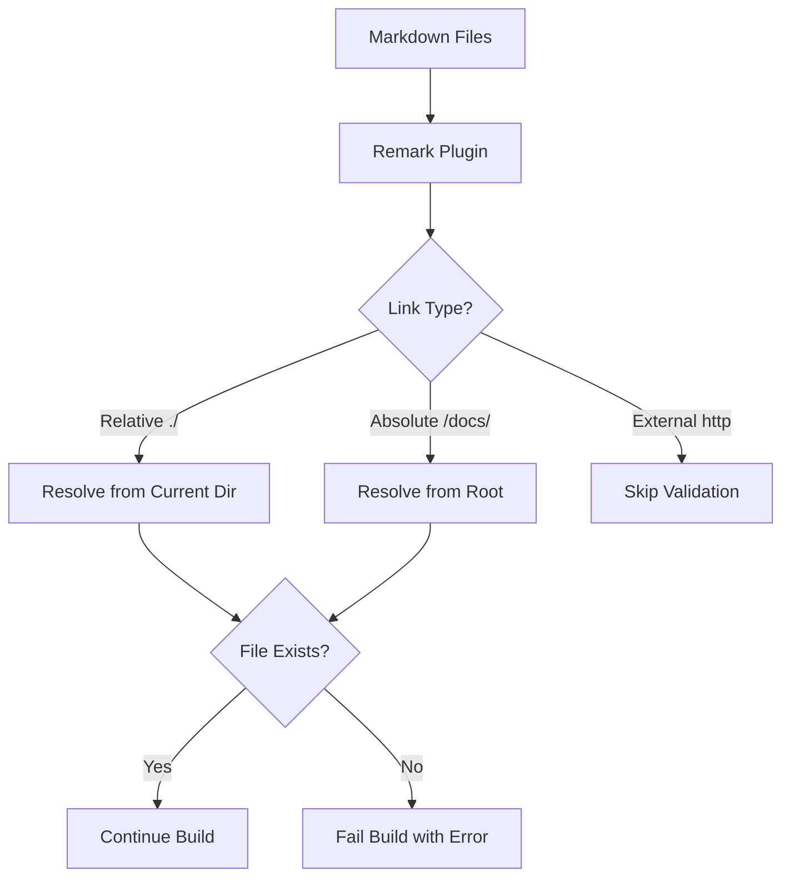

# ADR-005: Link Validation Strategy

## Status

✅ **ACCEPTED** - Implemented in build pipeline

## Context

Documentation contains many internal links using relative paths (`](./file.md)`). These links will break when:

1. **File reorganization** - Moving files between directories
2. **Content Collections migration** - Moving from `docs/` to `src/content/`
3. **Documentation restructuring** - Flattening or reorganizing guide structure

### Problem Statement

Hard-coded relative links create fragile documentation that breaks silently:

- Links work in development but 404 in production
- No build-time validation of internal references
- Manual link maintenance is error-prone and scales poorly
- Future Content Collections migration will require link updates

### Requirements

- Validate all internal links at build time
- Support both current relative links and future absolute references
- Fail fast with clear error messages
- Prepare for Content Collections migration
- Zero runtime performance impact

## Decision

**Implement build-time link validation using a custom remark plugin.**

### Architecture



### Implementation Details

1. **Remark Plugin** (`scripts/remark-validate-links.mjs`)
   - Processes all `.md` and `.mdx` files during build
   - Validates file existence for internal links
   - Supports multiple base paths for future migration

2. **Link Resolution Strategy**

   ```javascript
   // Priority order:
   1. Absolute paths: /docs/file.md → ${rootDir}/docs/file.md
   2. Relative paths: ./file.md → ${currentDir}/file.md  
   3. Extension inference: ./file → ./file.md (with warning)
   ```

3. **Error Handling**
   - **Strict mode**: Fail build on broken links
   - **Lenient mode**: Log warnings but continue
   - **Helpful errors**: Show file path, line number, target

## Considered Alternatives

### Option 1: Manual Link Maintenance

**Rejected** - Doesn't scale, error-prone, reactive not proactive

### Option 2: External Link Checker Tools

- **markdown-link-check**: External tool, requires separate CI step
- **broken-link-checker**: Runtime validation, not build-time
- **remark-validate-links**: Existing plugin but limited customization

**Rejected** - Prefer integrated build-time validation with custom requirements

### Option 3: Astro Content Collections Only

**Rejected** - Requires immediate migration, doesn't solve current link validation

### Option 4: URL-based References

```markdown
[Link](https://example.com/docs/file)
```

**Rejected** - Requires server setup, breaks offline development

## Consequences

### Positive ✅

- **Build-time validation** - Catch broken links before deployment
- **Clear error messages** - Know exactly which links are broken and where
- **Future-proof architecture** - Ready for Content Collections migration
- **Zero runtime overhead** - Validation only during build
- **Gradual migration path** - Existing relative links continue working

### Negative ❌

- **Build time increase** - Additional processing during build (minimal impact)
- **New dependency** - Requires `unist-util-visit` package
- **Learning curve** - Team needs to understand new link formats

### Neutral 🔄

- **Link format flexibility** - Support both relative and absolute during transition
- **Configuration required** - Need to specify base paths for validation

## Implementation Plan

### Phase 1: Foundation ✅

- \[x] Create remark plugin for link validation
- \[x] Integrate with Astro config (MDX + markdown)
- \[x] Add validation script to package.json
- \[x] Document migration strategy

### Phase 2: Validation (Next)

- \[ ] Test validation with existing documentation
- \[ ] Fix any broken links discovered
- \[ ] Add validation to CI pipeline
- \[ ] Create monitoring for link health

### Phase 3: Future Migration (Optional)

- \[ ] Convert relative links to absolute references
- \[ ] Implement Content Collections schema
- \[ ] Migrate documentation to `src/content/`
- \[ ] Update link validation config for new structure

## Configuration

```javascript
// astro.config.mjs
[remarkValidateLinks, { 
  rootDir: process.cwd(),
  basePaths: ['/docs', '/src/content'],  // Search these directories
  strict: true,                          // Fail build on broken links
  validateAnchors: false                 // TODO: Future enhancement
}]
```

## Rollback Strategy

If validation causes issues:

1. **Disable plugin** - Comment out from astro.config.mjs
2. **Lenient mode** - Set `strict: false` to log warnings only
3. **Remove dependency** - Uninstall `unist-util-visit` if needed

All existing relative links continue working without the plugin.

## Monitoring

- **Build logs** - Show validation results and suggestions
- **CI pipeline** - Fail builds on broken links
- **Documentation health** - Track link validation over time

## Related Decisions

- [ADR-000: Starter Template Architecture](/adr/000-starter-decisions/) - Foundation
- [ADR-001: Preact Island Usage Policy](/adr/001-preact-island-usage-policy/) - Component architecture
- [ADR-002: Performance Budget Strategy](/adr/002-performance-budget-strategy/) - Quality gates

## References

- [Remark Plugin Documentation](https://unifiedjs.com/learn/guide/create-a-plugin/)
- [Astro Content Collections](https://docs.astro.build/en/guides/content-collections/)
- [Unified AST Explorer](https://unifiedjs.com/explore/)
