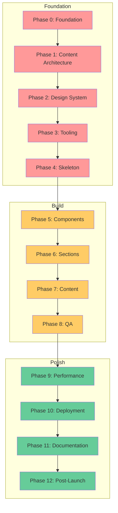

## Status

Accepted — supersedes [ADR-004: Optional Design System Tooling](./004-optional-design-system-tooling.md)
(the `build:mvp` / tooling-toggle concept was tied to the dual-track model this record retires)

## Context

The project currently offers two implementation tracks — MVP and Showcase — documented as separate paths through the same 13-phase system. This was designed to help users choose a complexity level, but in practice:

1. **Users don't select a track at clone time.** They work through phases sequentially and stop when they've reached their goals. There is no `--track=mvp` flag or conditional code path.
2. **The tracks create navigational overhead.** Every phase comparison table, the track selection UI on the landing page, and three dedicated track documents (`mvp-track-guide.md`, `showcase-track-guide.md`, `track-comparison.md`) add surface area without changing the underlying code.
3. **The distinction maps poorly to actual audiences.** The real divide isn't "MVP person vs Showcase person" — it's "how far do I go?" which the phase system already handles.
4. **AI assistants struggle with the duality.** The AI Context Index instructs assistants to "check if working on MVP or Showcase version" as step 1, but there's no machine-readable indicator of which track is active. This creates ambiguity in every AI interaction.
5. **Phase 0-4 are identical for both tracks.** The divergence only begins at Phase 5 (Components), where the difference is scope (fewer components vs more components), not architecture.

## Decision Drivers

- **Simplicity**: Reduce cognitive load for new users and AI assistants
- **Accuracy**: Model should reflect how users actually consume the template
- **Maintainability**: Eliminate duplicated documentation across track variants
- **AI Context Quality**: Provide unambiguous guidance for agentic development
- **Progressive Disclosure**: Users should understand "where they are" without choosing a persona

## Considered Options

### Option 1: Keep Dual Tracks (Status Quo)

**Description**: Maintain MVP and Showcase as separate documented paths.

**Pros**:

- Familiar to existing users
- Provides clear persona-based guidance

**Cons**:

- Creates false impression of two separate templates
- Doubles documentation maintenance for phase comparisons
- AI assistants can't reliably determine active track
- Phase 0-4 are identical, making the split feel artificial

### Option 2: Progressive Tier Model

**Description**: Replace tracks with three tiers (Foundation, Build, Polish) that represent natural stopping points in the phase progression.

**Pros**:

- Maps to actual user behavior (do phases, stop when done)
- Simplifies navigation — one path, three exit ramps
- AI assistants follow a linear progression
- Eliminates duplicate documentation
- Each tier has a clear deliverable

**Cons**:

- Loses explicit "this is for portfolios" vs "this is for enterprise" guidance
- Requires migration of existing track references
- Landing page needs redesign

### Option 3: Remove Tracks, Keep Phases Flat

**Description**: Eliminate tracks entirely and present all 13 phases as a single undifferentiated list.

**Pros**:

- Maximum simplicity

**Cons**:

- Loses the concept of natural stopping points
- 13 phases without grouping is overwhelming
- No guidance on "what's essential vs optional"

## Decision

We will implement **Option 2: Progressive Tier Model** with the following structure:

### Tier Definitions

| Tier | Phases | Deliverable | Exit Condition |
|------|--------|-------------|----------------|
| **Foundation** | 0–4 | Working site skeleton with design system, content schemas, and build pipeline | You have a deployable site with no content |
| **Build** | 5–8 | Complete site with components, pages, content, and quality assurance | You have a complete, tested site |
| **Polish** | 9–12 | Production-hardened site with performance optimization, monitoring, and documentation | You have an enterprise-grade deployment |

### Tier Characteristics

**Foundation (Phases 0-4)** — Everyone does these. Pre-configured in the template.

- Astro + TypeScript + Tailwind + Biome
- Content Collections schemas
- Design tokens system
- Base layouts and structural components
- CI pipeline

**Build (Phases 5-8)** — Where you make it yours.

- UI component implementation (scope to your needs)
- Page sections and layouts
- Content creation
- Quality assurance (manual or automated based on your needs)

**Polish (Phases 9-12)** — Production hardening.

- Performance optimization and budget enforcement
- Deployment configuration
- Documentation and AI context
- Post-launch monitoring and maintenance

### Scope Guidance Within Tiers

Instead of "MVP does X, Showcase does Y," each phase will include scope guidance:

- **Essential**: What every project needs from this phase
- **Recommended**: What most projects benefit from
- **Advanced**: What enterprise or portfolio-showcase projects should consider

This replaces the binary track choice with a spectrum that users navigate based on their project's actual needs.

### Implementation Details

**Files to remove:**

- `docs/tracks/mvp-track-guide.md`
- `docs/tracks/showcase-track-guide.md`
- `docs/tracks/track-comparison.md`
- `docs/tracks/` directory

**Files to create:**

- Update phase docs to use Essential/Recommended/Advanced scope labels

**Files to update:**

- `docs/implementation-guides/README.md` — Replace track references with tier model
- `docs/ai-context/INDEX.md` — Remove track-checking step, add tier awareness
- `docs/adr/000-starter-decisions.md` — Note that dual-track approach refined by ADR-033
- Landing page (`src/pages/index.astro`) — Replace track selection with tier overview
- `.windsurfrules` — Update AI rules to reference tiers
- `README.md` — Update any track references

**Mermaid diagram update:**

**Legend**: 🔴 Foundation (everyone) | 🟡 Build (make it yours) | 🟢 Polish (production-harden)

## Consequences

### Positive

- Simpler mental model for users and AI assistants
- Eliminates ~3 documents and dozens of comparison tables
- Tier names communicate deliverables, not personas
- AI context becomes unambiguous (linear progression, no track branching)
- Natural stopping points are clearer than binary track choice
- Existing phase content is preserved — only the organizational wrapper changes

### Negative

- Loses the explicit "portfolio vs enterprise" persona guidance. Mitigated by adding a "Portfolio Checklist" reference doc that cross-references relevant phases and Advanced scope items.
- Existing links to `/tracks/mvp-track-guide/` and `/tracks/showcase-track-guide/` will break. Mitigated by adding redirects in Starlight config.
- Users familiar with the old model need to re-orient. Mitigated by clear migration note in CHANGELOG.

### Neutral

- Phase numbering (0-12) is unchanged
- Phase content is unchanged — only wrapper documentation and cross-references change
- Performance budgets remain the same across all tiers (no "relaxed" Foundation budgets)

## Validation

- **Documentation Reduction**: Track-specific content removed or consolidated (target: net reduction of 2+ documents)
- **AI Context Clarity**: AI assistants can determine project state from a single `current_tier` value
- **User Feedback**: Monitor GitHub issues/discussions for confusion after migration
- **Navigation Metrics**: If analytics enabled on docs site, check for reduced bounce rates on implementation guide pages

## References

- [ADR-000: Starter Template Architecture](/adr/000-starter-decisions/) — Original dual-track decision
- [ADR-004: Optional Design System Tooling](/adr/004-optional-design-system-tooling/) — superseded by this ADR
- Track Comparison — removed per this ADR
- [Implementation Guide Master Index](https://github.com/clownware/astro-performance-starter/tree/master/docs/implementation-guides)

## Notes

The "Portfolio Checklist" reference doc mentioned in consequences should be created as part of the implementation. It replaces the persona-based guidance that the Showcase track provided, reframed as a curated list of phases and scope items that result in a portfolio-quality site.

The Essential/Recommended/Advanced scope labels within each phase may be implemented incrementally — start with active phases (5-8) and backfill completed phases (0-4) as needed.

## Enforcement

<!-- Added 2026-07-12 as an amendment under the enforcement architecture ADR (ADR-064). The original record above is unmodified. -->

- **Not machine-checkable:** the Foundation/Build/Polish tier model is documentation semantics; no structural invariant is derivable.
- **Graduation log:** _(empty at creation; entries added when a check changes status)_

---
**Date**: 2026-02-22\
**Participants**: Template maintainers\
**Outcome**: Accepted
