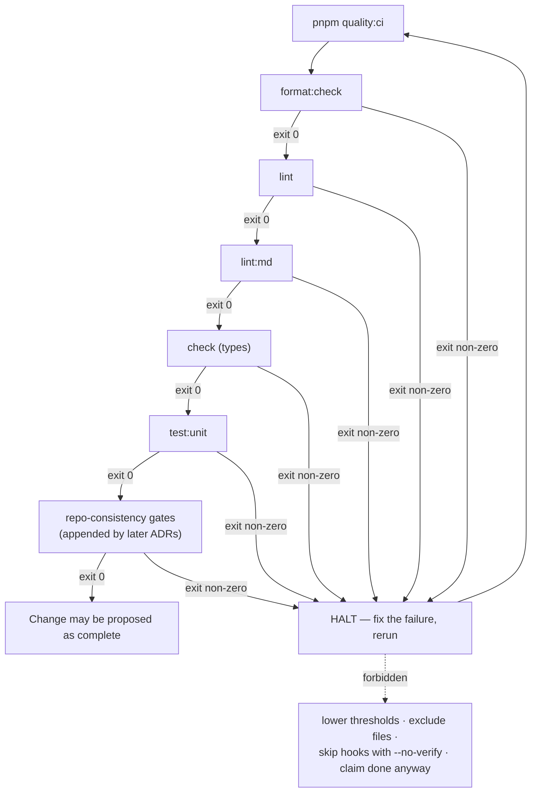

## Status

Accepted

## Context

[ADR-036](036-layered-constitution.md) rewrote the constitution rules in halt-on-violation language, but the underlying tooling and surrounding prose still carried softer "verify with" framing in several places. Two specific gaps remained:

1. **`pnpm quality:ci` did not run unit tests.** Its chain was `format:check && lint && lint:md && check`. Meanwhile, the CI workflow (`.github/workflows/ci.yml`) added a separate `pnpm run test:coverage` step in PR #213. The result was a local↔CI divergence: running `pnpm quality:ci` locally could pass while CI failed on a broken unit test. The agent following Rule 9 ("run `pnpm quality:ci` before claiming done") could legitimately believe the change was complete despite a broken test.

2. **Language softness in sublayer files.** Several places in `.claude/workflow.md` and the engineering notes still said "verify with `pnpm run X`" rather than the constitution-grade "if `pnpm run X` exits non-zero, halt and fix the failure." The difference matters: "verify" implies a check that produces a report; "halt" implies a gate that produces a stop.

ADR-039 closes both gaps. The mechanical change is a one-line script edit. The substantive change is the explicit decision that `pnpm quality:ci` _is_ the local gate, and that everything else in the docs has to reflect that.

## Decision Drivers

- **Local↔CI parity**: a failing test on `master` must be reproducible locally with `pnpm quality:ci`
- **Halt semantics**: a "gate" must be distinct from a "check" in the language, not just the implementation
- **Cost discipline**: avoid restructuring CI jobs (parallel `test-unit` job) at the scale this template operates — single-developer template, not a 20-engineer monorepo
- **Composability**: the Reviewer pass in [ADR-038](038-agent-roles.md) runs `pnpm quality:ci`; it must produce the same signal as CI

## Considered Options

### Option 1: Add a parallel `test-unit` job in CI

**Description**: Split `.github/workflows/ci.yml`'s single `build-test` job into parallel `quality` + `test-unit` jobs. Each has its own setup, cache, and matrix.

**Pros**:

- Faster CI wall-clock at scale (when test runtime is large)
- Independent failure signals (quality failure vs test failure clearly separated)
- Matches how larger repos structure their gates

**Cons**:

- Real CI rewrite: matrix configuration, artefact passing, cache key alignment
- Marginal value at template scale — current test wall-clock is under one minute
- Adds infrastructure that would have to be maintained even when test count is small
- Doesn't solve the local↔CI parity problem; only changes where the test step lives in CI

### Option 2: Leave `quality:ci` as-is and document the gap

**Description**: Update language to acknowledge that CI runs `test:coverage` separately from `quality:ci`. Train operators to run `pnpm test:unit` separately before claiming done.

**Pros**:

- Zero script changes
- No risk of breaking existing local workflows

**Cons**:

- Two-step gate ("run `quality:ci` _and_ `test:unit`") is exactly the kind of process discipline that erodes
- Rule 9 in `CLAUDE.md` becomes a lie of omission — the named command doesn't actually catch broken tests
- The Reviewer pass in ADR-038 ends up needing to invoke two commands explicitly

### Option 3: Extend `pnpm quality:ci` to chain `test:unit` (this ADR)

**Description**: One-line script change. `quality:ci` becomes `"format:check && lint && lint:md && check && test:unit"`. Local devs run `test:unit` (fast, no instrumentation). CI continues running `test:coverage` for the artefact upload added in PR #213 — the asymmetry is documented but doesn't break parity (both run the same tests; only instrumentation differs).

**Pros**:

- One-line script change; tiny diff, easy to revert
- Local `pnpm quality:ci` now catches what CI catches
- Rule 9 in `CLAUDE.md` becomes truthful — the named command is the gate
- Reviewer pass in ADR-038 just runs `pnpm quality:ci` and gets full signal
- Defers structural CI changes (parallel jobs) to a future ADR when scale warrants

**Cons**:

- Local `quality:ci` is slightly slower (test runtime added)
- The instrumentation asymmetry (local `test:unit`, CI `test:coverage`) needs explicit documentation
- Doesn't scale forever — at some test-suite size, parallel jobs become worth the CI rewrite

## Decision

We will go with **Option 3 (Extend `pnpm quality:ci` to chain `test:unit`)** because it closes the local↔CI parity gap at one-line cost, makes Rule 9 truthful, and defers the parallel-jobs decision to a future ADR opened when test wall-clock warrants it.

### Specific changes

**`package.json`:**

```diff
- "quality:ci": "pnpm run format:check && pnpm run lint && pnpm run lint:md && pnpm run check",
+ "quality:ci": "pnpm run format:check && pnpm run lint && pnpm run lint:md && pnpm run check && pnpm run test:unit",
```

`quality` (the auto-fixing local variant) does NOT chain tests, so the iterative local loop stays fast. Tests are only chained into the explicit-gate variant.

**Documented asymmetry (in `.claude/workflow.md`):**

> Local-vs-CI parity: `pnpm quality:ci` runs `format:check + lint + lint:md + check + test:unit`. CI runs the same plus `test:coverage` (for the artefact upload added in PR #213). Same tests; only v8 instrumentation differs.

**Language hardening in `.claude/workflow.md` and engineering notes:**

Replace any remaining "verify with" softness with explicit halt-on-violation form:

| Before | After |
|---|---|
| "Verify with `pnpm run X`" | "Run `pnpm run X`. If it exits non-zero, halt and fix the failure. Do not propose the change as complete." |
| "Make sure tests pass" | "If tests fail, halt and either fix the test or revise the production code. Do not skip with `--no-verify`." |
| "Check that …" | "If … fails, halt and …" |

The form is consistent: condition → halt → corrective action → forbidden workaround.

### Gate shape

The same condition → halt → corrective action → forbidden workaround form applies at every link of the `quality:ci` chain (later ADRs append further links — ADR-045 `agents:check`, ADR-061 `version:check`, and so on — without changing the shape):



### Trigger conditions for future re-evaluation

Open a successor ADR proposing parallel CI jobs when:

- Test wall-clock exceeds 2 minutes, OR
- The single `build-test` job's total runtime crosses 10 minutes, OR
- A second test framework joins the suite (e.g. visual regression) that would benefit from independent gating

Until any of those conditions, the single-job structure stands.

## Consequences

### Positive

- `pnpm quality:ci` is now truthful — the named gate catches what CI catches
- Rule 9 in `CLAUDE.md` is enforceable
- ADR-038's Reviewer pass produces a complete signal with one command
- Operators can no longer accidentally believe a change is complete when tests are broken
- Language across sublayer files matches the constitution's halt-on-violation tone

### Negative

- Local `quality:ci` is slightly slower (current test wall-clock: under one second; impact: trivial)
- The local↔CI instrumentation asymmetry (test:unit vs test:coverage) is one more thing to know
- Some existing "verify with" language across docs needs sweeping — done in this commit

### Neutral

- No production code or test code changes
- The fast `pnpm quality` (auto-fixing) variant is unchanged; iterative inner loop stays fast
- ADR-023's coverage targets, ADR-037's testing rules, ADR-038's role taxonomy are all unaffected

## Validation

- A PR introducing a deliberately broken unit test fails `pnpm quality:ci` locally (exit code 1)
- The same PR also fails `pnpm quality:ci` in CI (same exit, same step)
- `grep -r "verify with" CLAUDE.md .claude/` returns zero matches
- The documented asymmetry is present in `.claude/workflow.md`

## References

- [ADR-036: Layered Constitution](036-layered-constitution.md) — established the halt-on-violation pattern this ADR enforces
- [ADR-037: Testing Philosophy](037-testing-philosophy.md) — Rule 5 ("never lower a threshold") is enforced by this gate
- [ADR-038: Agent Roles](038-agent-roles.md) — the Reviewer pass runs `pnpm quality:ci`
- [ADR-023: Testing Strategy](023-testing-strategy.md) — coverage targets that the gate must respect
- PR #213 — added `test:coverage` to the CI workflow

## Notes

The choice to chain `test:unit` (rather than `test:coverage`) in `quality:ci` is deliberate. Locally, instrumentation overhead doesn't earn its keep — operators care about pass/fail, not coverage delta, on the iterative loop. CI still runs `test:coverage` because the artefact upload feeds the badge and the trend tracking. Same tests; same pass/fail signal; only the reporter changes.

The "verify with" → "halt and fix" sweep is one-off. New documentation should use halt-on-violation form from the start; reviewers should reject "verify with" language in new ADRs.

---

**Date**: 2026-05-16\
**Participants**: Chris Pezza, Claude\
**Outcome**: Accepted

## Enforcement

<!-- Added 2026-07-12 as an amendment under the enforcement architecture ADR (ADR-064). The original record above is unmodified. -->

- **Testable consequences:**
  - TC-1: `.github/workflows/ci.yml` runs `pnpm run quality:ci`.
  - TC-2: the `quality:ci` script retains its documented gate steps.
- **Checks:**
  - TC-1, TC-2 → check `ci-runs-quality` (status: **warn**)
- **Not machine-checkable:** that operators actually run the gate locally before claiming done is process discipline; no edit-time hook automates it — ADR-064 records the sketched Stop-gate as not shipped, so CI is the backstop.
- **Graduation log:** _(empty at creation; entries added when a check changes status)_
