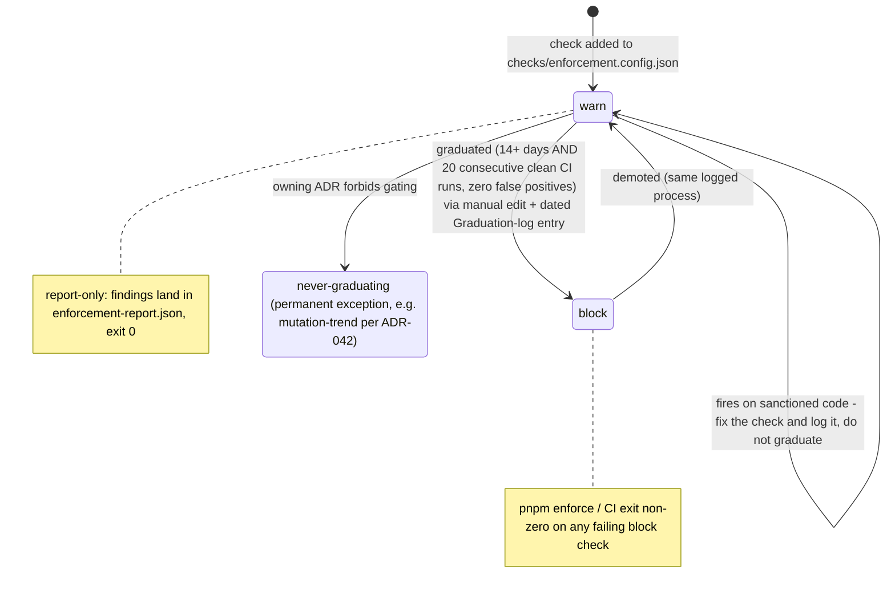

## Status

Accepted

## Context

PR #327 (2026-08-02) retrofitted an **Enforcement section onto every ADR**: each
Accepted record lists its testable consequences (TCs), maps them to check ids,
and carries a graduation log. The machine side is
`checks/enforcement.config.json` (the registry) and
`scripts/src/run-enforcement.ts` (the runner behind `pnpm enforce`, executed in
CI by `ci.yml`).

The amendment comments and the config's `$comment` all pointed at "the
enforcement architecture ADR (ADR-062)" for the architecture and its graduation
rules. That record was never written: by the time #327 merged, ADR-062 had been
taken by the Astro 7 upgrade (#318), and no ADR at any number documented the
architecture. The graduation rules the suite's output cites
(`run-enforcement.ts` prints "graduation rules: ADR-062") existed nowhere. The
2026-08 documentation audit flagged the dangling citation in 62 files.

This record is that missing ADR. It documents the architecture as shipped and
defines the graduation rules. The 62 citations now point here.

## Decision Drivers

- Every ADR's Enforcement section needs a real record to cite for shared
  semantics (statuses, graduation), instead of repeating them 62 times.
- Graduation from warn to block must be a deliberate, logged decision — silent
  ratchets erode trust in the suite; permanent warn-only trains everyone to
  ignore it.
- The registry schema is shared with go-performance-starter and must stay
  portable.

## Considered Options

### Option 1: Repoint the citations to ADR-039

ADR-039 (halt-on-violation via the `quality:ci` chain) is the nearest existing
record, but it documents one gate's wiring, not the per-ADR TC/check/graduation
architecture. Overloading it would leave the graduation rules undocumented or
bolted onto an unrelated decision.

### Option 2: Renumber the Astro 7 record to free ADR-062

Breaks the log's own convention ("never renumber or delete") and every external
link to ADR-062.

### Option 3: Write the missing record as ADR-064 (this ADR)

Document the shipped architecture at the next free number and sweep the 62
citations to it. Honest about the history; no renumbering.

## Decision

Adopt Option 3. The enforcement architecture is:

### Implementation Details

- **Per-ADR Enforcement sections.** Every ADR ends with an Enforcement section
  listing: *Testable consequences* (TC-n), *Checks* (TC → check id → status),
  *Not machine-checkable* (honest residue), and a *Graduation log*.
  Non-Accepted records carry an explicit not-enforced stub.
- **Registry.** `checks/enforcement.config.json` holds one entry per check:
  `{id, adr, tc, status, added, graduated}`. `status` is `warn` or `block`.
  Entries with an `external` field are **delegated**: enforced by a
  pre-existing gate (CI step, `quality:ci` link, build plugin) and reported by
  the runner without being re-run.
- **Runner.** `pnpm enforce` (`scripts/src/run-enforcement.ts`) executes the
  native checks, writes `enforcement-report.json`, and exits non-zero only when
  a block-status check fails. Warn-status findings are report-only. CI runs the
  suite on every push/PR.
- **Graduation rules (warn → block).** A warn-status check graduates when, over
  a calibration window of **at least 14 days and 20 consecutive CI runs**, it
  produced **zero false positives** (every finding was a real violation or was
  fixed). Graduation is a manual edit: set `status: "block"`, stamp
  `graduated: "<date>"`, and append a dated entry to the owning ADR's
  Graduation log naming who graduated it and why. A check that fires on
  sanctioned code is miscalibrated: fix the check (and log it), don't graduate
  it. Demotion (block → warn) follows the same logged process.
- **Permanent exceptions.** A check may be marked never-graduating when its
  owning ADR forbids gating (e.g. `mutation-trend` — ADR-042 forbids PR-gating
  mutation scores). The exception lives in the registry entry's `external`/note
  text and the owning ADR.
- **Enforcement surface.** The suite's surfaces are CI and the local
  `pnpm enforce` / `quality:ci` chain. Edit-time agent hooks (a PreToolUse
  guard, a Stop-gate) were sketched in the #327 amendment text but **not
  shipped**; no hook mechanism exists in this repo. If they land later, they
  extend this record via amendment.

### Check lifecycle

## Consequences

### Positive

- The 62 Enforcement sections cite a record that exists and answers "what does
  warn mean, and when does it become block".
- Graduation is auditable: registry field + per-ADR log.

### Negative

- The calibration bar (14 days / 20 clean runs) is a policy choice this record
  now owns; changing it requires amending this ADR.

### Neutral

- The registry schema is unchanged — this ADR documents, it does not migrate.

## Validation

- `pnpm enforce` exits 0 with warn-status findings and non-zero on any
  block-status failure.
- `grep -r "ADR-062" checks/ docs/adr/*/Enforcement` finds no enforcement
  citations pointing at the Astro 7 record.
- The `adr-log-valid` check validates Enforcement-section shape across the log.

## References

- PR #327 — enforcement sections + warn-only check suite
- `checks/enforcement.config.json`, `scripts/src/run-enforcement.ts`
- [ADR-039](039-halt-on-violation-enforcement.md) — the `quality:ci` halt gate
- [ADR-042](042-mutation-testing-with-stryker.md) — the never-graduating metric
- 2026-08 documentation audit — dangling-citation finding

## Notes

Participants: template maintainers. The graduation window starts at a check's
`added` date; checks added 2026-07-12 became graduation-eligible 2026-07-26 and
graduate individually as their false-positive record is confirmed.

## Enforcement

- **Testable consequences:**
  - TC-1: every ADR carries one of the four canonical status words.
  - TC-2: numbering is gapless — gaps exist only as explicit reserved stubs.
  - TC-3: superseded records carry forward links to their replacements.
  - TC-4: every ADR ends with an Enforcement section (or the not-enforced stub).
- **Checks:**
  - TC-1..4 → check `adr-log-valid` (status: **warn**)
- **Not machine-checkable:** that the calibration judgment (zero false
  positives) was made honestly is process discipline.
- **Graduation log:** *(empty at creation; entries added when a check changes status)*
