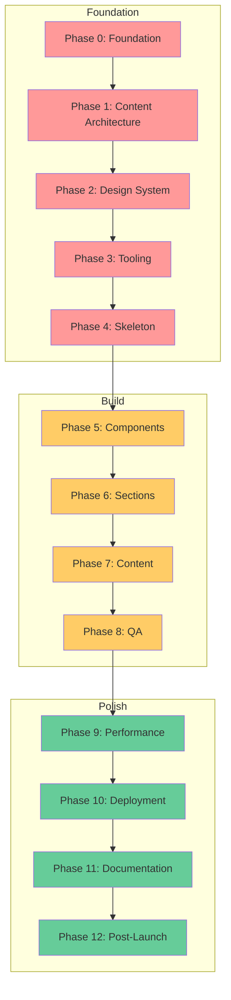

<Badge variant="success">Done</Badge>

## Quick Start

This guide provides a structured approach to building high-performance Astro sites through a single progressive path with three natural tiers:

- **Foundation (Phases 0–4)**: Core setup — everyone starts here
- **Build (Phases 5–8)**: Make it yours — components, content, QA
- **Polish (Phases 9–12)**: Production-harden — performance, deployment, docs

Work through phases sequentially and stop when you've reached your goals. See [ADR-033](/adr/033-track-consolidation/) for the rationale behind this model.

## Phase Dependency Map

**Legend**: 🔴 Foundation (everyone) | 🟡 Build (make it yours) | 🟢 Polish (production-harden)

## Tier Overview

### Foundation (Phases 0–4) — Everyone does these

Pre-configured in the template. Delivers a deployable site skeleton with no content.

- Astro + TypeScript + Tailwind + Biome
- Content Collections schemas
- Design tokens system
- Base layouts and structural components
- CI pipeline

### Build (Phases 5–8) — Where you make it yours

Scope each phase to your project's actual needs using the Essential / Recommended / Advanced labels within each guide.

- UI component implementation
- Page sections and layouts
- Content creation
- Quality assurance

### Polish (Phases 9–12) — Production hardening

Stop here when you need an enterprise-grade deployment.

- Performance optimization and budget enforcement
- Deployment configuration
- Documentation and AI context
- Post-launch monitoring and maintenance

## Phase Overview

### ✅ Completed Phases (Foundation)

| Phase | Name | Scope | Status |
|-------|------|-------|--------|
| 0 | [Foundation](/implementation-guides/completed/phase-0-foundation/) | Essential | ✅ Complete |
| 1 | [Content Architecture](/implementation-guides/completed/phase-1-content-arch/) | Essential | ✅ Complete |
| 2 | [Design System](/implementation-guides/completed/phase-2-design-system/) | Essential | ✅ Complete |
| 3 | [Tooling](/implementation-guides/completed/phase-3-tooling/) | Essential | ✅ Complete |
| 4 | [Skeleton](/implementation-guides/completed/phase-4-skeleton/) | Essential | ✅ Complete |

### 🚧 Active Phases (Build)

| Phase | Name | Scope | Effort | Critical Path |
|-------|------|-------|--------|---------------|
| 5 | [Components](/implementation-guides/active-phases/phase-5-components/) | Essential → Advanced | 2-4 days | ⚡ |
| 6 | [Sections](/implementation-guides/active-phases/phase-6-sections/) | Essential → Advanced | 2-3 days | ⚡ |
| 7 | [Content](/implementation-guides/active-phases/phase-7-content/) | Essential | 3-5 days | 📝 |
| 8 | [QA](/implementation-guides/active-phases/phase-8-qa/) | Essential → Advanced | 1-3 days | ✓ |

### 🚧 Active Phases (Polish)

| Phase | Name | Scope | Effort | Critical Path |
|-------|------|-------|--------|---------------|
| 9 | [Performance](/implementation-guides/active-phases/phase-9-performance/) | Essential | 1-2 days | ✓ |
| 10 | [Deployment](/implementation-guides/active-phases/phase-10-deployment/) | Essential | 1 day | 🚀 |
| 11 | [Documentation](/implementation-guides/active-phases/phase-11-documentation/) | Recommended | 1-2 days | 📚 |
| 12 | [Post-Launch](/implementation-guides/active-phases/phase-12-post-launch/) | Recommended | 1 day | 🎯 |

## Getting Started

1. **Review Tech Stack**: Check [technology choices](/implementation-guides/reference/tech-stack/)
2. **Understand Budgets**: Study [performance targets](/implementation-guides/reference/budgets-guardrails/)
3. **Set Up Structure**: Follow [directory layout](/implementation-guides/reference/directory-structure/)
4. **Begin Phase 0**: Start with [foundation decisions](/implementation-guides/completed/phase-0-foundation/)
5. **Stop when done**: Each tier has a clear deliverable — ship when it meets your goals

## Additional Resources

### 📖 Topic Guides

- [Accessibility Guide](/implementation-guides/guides/accessibility-guide/) - WCAG AA compliance patterns
- [Components Guide](/implementation-guides/guides/components-guide/) - Component architecture best practices
- [Content Model Guide](/implementation-guides/guides/content-model-guide/) - Content Collections patterns
- [Image Optimization Guide](/implementation-guides/guides/image-optimization-guide/) - Performance-first image strategies
- [Responsive Design Guide](/implementation-guides/guides/responsive-design-guide/) - Mobile-first patterns and breakpoint usage
- [Testing Strategy Guide](/implementation-guides/guides/testing-strategy-guide/) - QA and testing approaches
- [Rollback Strategies Guide](/implementation-guides/guides/rollback-strategies-guide/) - Deployment safety patterns

### 💻 Code Examples

Each active phase includes practical code examples:

- [Phase 5 Examples](/implementation-guides/code-examples/phase-5-code-examples/) - Component implementations
- [Phase 6 Examples](/implementation-guides/code-examples/phase-6-code-examples/) - Section layouts
- [Phase 7 Examples](/implementation-guides/code-examples/phase-7-code-examples/) - Content patterns
- [Phase 8 Examples](/implementation-guides/code-examples/phase-8-code-examples/) - QA testing code
- [Phase 9 Examples](/implementation-guides/code-examples/phase-9-code-examples/) - Performance optimizations
- [Phase 10 Examples](/implementation-guides/code-examples/phase-10-code-examples/) - Deployment configurations
- [Phase 12 Examples](/implementation-guides/code-examples/phase-12-code-examples/) - Post-launch monitoring

### 📚 Reference Documentation

- [Tech Stack](/implementation-guides/reference/tech-stack/) - Complete technology overview
- [Directory Structure](/implementation-guides/reference/directory-structure/) - Project organization
- [Budgets & Guardrails](/implementation-guides/reference/budgets-guardrails/) - Performance targets
- [Portfolio Checklist](/implementation-guides/reference/portfolio-checklist/) - Curated scope items for portfolio-quality sites
- [Optional Analytics](/implementation-guides/reference/optional-analytics/) - Tracking implementation
- [Table Format Guide](/implementation-guides/reference/table-format-guide/) - Documentation standards

## Common Patterns

- [Islands Architecture](/implementation-guides/patterns/islands-architecture/) - When to add interactivity
- [Content Collections](/implementation-guides/patterns/content-collections/) - Advanced content patterns
- [Performance Patterns](/implementation-guides/patterns/performance-patterns/) - Optimization techniques
- [Component Patterns](/implementation-guides/patterns/component-patterns/) - Reusable UI patterns

## Scope Decision Matrix

| Need | Essential | Recommended | Advanced |
|------|-----------|-------------|----------|
| Interactivity | Static HTML + CSS | CSS + minimal JS for simple state | Preact islands where justified |
| Testing | Manual checklist | Playwright critical paths | Full suite + visual regression |
| Components | Core UI only | Extended component library | Astrobook + full documentation |
| Documentation | README + basics | AI context updated | Comprehensive guides |
| Monitoring | Basic uptime | Lighthouse CI | RUM + error tracking |

## Support & Updates

- **Changelog**: [CHANGELOG.md](/CHANGELOG/)
- **Issues**: Create an issue in your project repo
- **Updates**: Check monthly for Astro updates
- **Community**: [Astro Discord](https://astro.build/chat)
