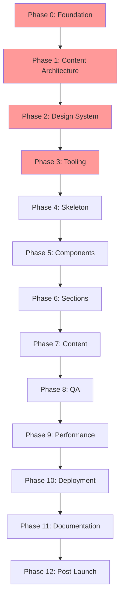

<Badge variant="success">Done</Badge>

## Quick Start

This guide provides a structured approach to building high-performance Astro sites with two implementation tracks:

- **MVP Track**: Fast, focused delivery with essential features
- **Showcase Track**: Advanced implementation demonstrating technical excellence

## Phase Dependency Map

**Legend**: 🔴 Foundation (Immutable) | 🟡 Structure | 🟢 Implementation | 🔵 Quality | ⚫ Deployment

## Implementation Tracks

### MVP Track

- **Goal**: Ship a performant, accessible site as quickly as possible
- **Focus**: Content presentation, zero JavaScript, essential features
- **Best For**: Portfolios, blogs, marketing sites

### Showcase Track

- **Goal**: Demonstrate advanced technical capabilities
- **Focus**: Component architecture, testing, advanced patterns
- **Best For**: Technical portfolios, team projects, enterprise sites

[See detailed track comparison →](/implementation-guides/tracks/track-comparison/)

## Phase Overview

### ✅ Completed Phases

| Phase | Name | MVP | Showcase | Status |
|-------|------|-----|----------|--------|
| 0 | [Foundation](/implementation-guides/completed/phase-0-foundation/) | Full | Full | ✅ Complete |
| 1 | [Content Architecture](/implementation-guides/completed/phase-1-content-arch/) | Full | Full | ✅ Complete |
| 2 | [Design System](/implementation-guides/completed/phase-2-design-system/) | Full | Full | ✅ Complete |
| 3 | [Tooling](/implementation-guides/completed/phase-3-tooling/) | Full | Full | ✅ Complete |
| 4 | [Skeleton](/implementation-guides/completed/phase-4-skeleton/) | Full | Full | ✅ Complete |

### 🚧 Active Development Phases

| Phase | Name | MVP | Showcase | Effort | Critical Path |
|-------|------|-----|----------|----------|---------------|
| 5 | [Components](/implementation-guides/active-phases/phase-5-components/) | Lite | Full | 2-4 days | ⚡ |
| 6 | [Sections](/implementation-guides/active-phases/phase-6-sections/) | Lite | Full | 2-3 days | ⚡ |
| 7 | [Content](/implementation-guides/active-phases/phase-7-content/) | Full | Full | 3-5 days | 📝 |
| 8 | [QA](/implementation-guides/active-phases/phase-8-qa/) | Lite | Full | 1-3 days | ✓ |
| 9 | [Performance](/implementation-guides/active-phases/phase-9-performance/) | Full | Full | 1-2 days | ✓ |
| 10 | [Deployment](/implementation-guides/active-phases/phase-10-deployment/) | Full | Full | 1 day | 🚀 |
| 11 | [Documentation](/implementation-guides/active-phases/phase-11-documentation/) | Lite | Full | 1-2 days | 📚 |
| 12 | [Post-Launch](/implementation-guides/active-phases/phase-12-post-launch/) | Lite | Full | 1 day | 🎯 |

## Getting Started

1. **Choose Your Track**: Review [track comparison](/implementation-guides/tracks/track-comparison/)
2. **Review Tech Stack**: Check [technology choices](/implementation-guides/reference/tech-stack/)
3. **Understand Budgets**: Study [performance targets](/implementation-guides/reference/budgets-guardrails/)
4. **Set Up Structure**: Follow [directory layout](/implementation-guides/reference/directory-structure/)
5. **Begin Phase 0**: Start with [foundation decisions](/implementation-guides/completed/phase-0-foundation/)

## Additional Resources

### 📖 Topic Guides

- [Accessibility Guide](/implementation-guides/guides/accessibility-guide/) - WCAG AA compliance patterns
- [Components Guide](/implementation-guides/guides/components-guide/) - Component architecture best practices  
- [Content Model Guide](/implementation-guides/guides/content-model-guide/) - Content Collections patterns
- [Image Optimization Guide](/implementation-guides/guides/image-optimization-guide/) - Performance-first image strategies
- [Testing Strategy Guide](/implementation-guides/guides/testing-strategy-guide/) - QA and testing approaches
- [Rollback Strategies Guide](/implementation-guides/guides/rollback-strategies-guide/) - Deployment safety patterns

### 💻 Code Examples

Each active phase includes practical code examples:

- [Phase 5 Examples](/implementation-guides/code-examples/phase-5-code-examples/) - Component implementations
- [Phase 6 Examples](/implementation-guides/code-examples/phase-6-code-examples/) - Section layouts
- [Phase 7 Examples](/implementation-guides/code-examples/phase-7-code-examples/) - Content patterns
- [Phase 8 Examples](/implementation-guides/code-examples/phase-8-code-examples/) - QA testing code
- [Phase 9 Examples](/implementation-guides/code-examples/phase-9-code-examples/) - Performance optimizations
- [Phase 10 Examples](/implementation-guides/code-examples/phase-10-code-examples/) - Deployment configurations
- [Phase 12 Examples](/implementation-guides/code-examples/phase-12-code-examples/) - Post-launch monitoring

### 📚 Reference Documentation

- [Tech Stack](/implementation-guides/reference/tech-stack/) - Complete technology overview
- [Directory Structure](/implementation-guides/reference/directory-structure/) - Project organization
- [Budgets & Guardrails](/implementation-guides/reference/budgets-guardrails/) - Performance targets
- [Optional Analytics](/implementation-guides/reference/optional-analytics/) - Tracking implementation
- [Table Format Guide](/implementation-guides/reference/table-format-guide/) - Documentation standards

## Common Patterns

- [Islands Architecture](/implementation-guides/patterns/islands-architecture/) - When to add interactivity
- [Content Collections](/implementation-guides/patterns/content-collections/) - Advanced content patterns
- [Performance Patterns](/implementation-guides/patterns/performance-patterns/) - Optimization techniques
- [Component Patterns](/implementation-guides/patterns/component-patterns/) - Reusable UI patterns

## Quick Decision Matrix

| Need | MVP Choice | Showcase Choice |
|------|------------|-----------------|
| Interactivity | Static HTML + CSS | Islands where justified |
| Testing | Manual checklist | Playwright + Visual |
| Components | Essential only | Full library + Astrobook |
| Documentation | README + basics | Comprehensive guides |
| Monitoring | Basic uptime | RUM + Error tracking |

## Support & Updates

- **Changelog**: [CHANGELOG.md](/CHANGELOG/)
- **Issues**: Create an issue in your project repo
- **Updates**: Check monthly for Astro updates
- **Community**: [Astro Discord](https://astro.build/chat)
