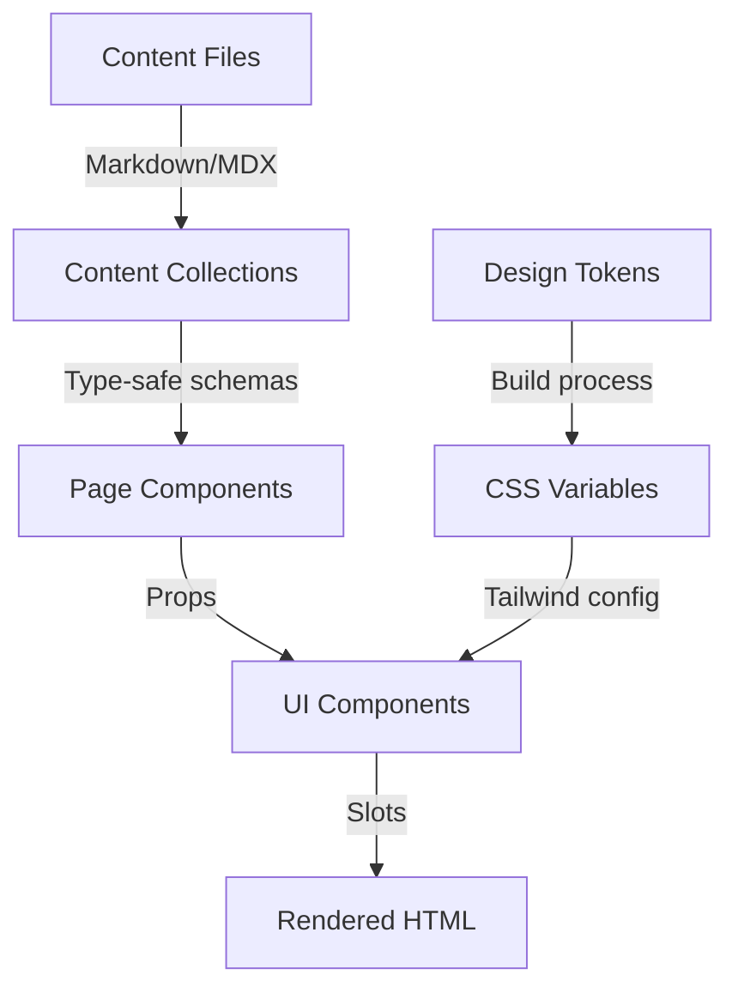

## Overview

- **Tier**: Polish (Phase 11 of 12)
- **Duration**: 1-2 days
- **Dependencies**: Phase 0-10 completed
- **Deliverables**: README, setup guides, component docs, maintenance procedures

## Entry Criteria

- [ ] Site deployed and live
- [ ] All features implemented
- [ ] Testing complete
- [ ] Monitoring active

## Implementation Steps

| Step | Task | Scope | Notes |
|------|------|-------|-------|
| 11.01 | Write README.md | Essential | Project overview and setup; expand with architecture as Recommended |
| 11.02 | Document environment setup | Essential | Required variables first; comprehensive config as Recommended |
| 11.03 | Create quick start guide | Essential | Get running in 5 mins |
| 11.04 | List available scripts | Essential | Package.json commands |
| 11.05 | Basic troubleshooting | Essential | Common issues |
| 11.06 | Deployment instructions | Essential | How to deploy; multi-environment guide as Advanced |
| 11.07 | Content management guide | Essential | Adding/editing content |
| 11.08 | License and credits | Essential | Open source attribution |
| 11.09 | Architecture overview | Recommended | System design docs |
| 11.10 | Component documentation | Recommended | Props, usage, examples |
| 11.11 | API documentation | Advanced | Endpoints, responses (if applicable — the starter is static) |
| 11.12 | Performance guide | Recommended | Optimization tips |
| 11.13 | Security documentation | Recommended | Best practices |
| 11.14 | Testing guide | Recommended | How to run tests |
| 11.15 | Contributing guide | Advanced | For open source projects |
| 11.16 | Changelog | Recommended | Version history (`pnpm run release:changelog` generates it from conventional commits) |
| 11.17 | Migration guides | Advanced | Upgrading versions |

## Documentation Structure

### 1. README.md (Main Documentation)

````markdown
# [Project Name]


A lightning-fast portfolio site built with Astro, achieving Lighthouse target benchmarks (Performance 95+, Accessibility 100, Best-Practices 100, SEO 100) through modern web development practices.

## ✨ Features

- 🚀 **Blazing Fast**: Performance 95+, Accessibility 100, Best-Practices 100, SEO 100
- 🎨 **Beautiful Design**: Tailwind CSS with custom design system
- ♿ **Accessible**: WCAG AA compliant
- 📱 **Responsive**: Mobile-first approach
- 🌙 **Dark Mode**: System preference detection
- 🔍 **SEO Optimized**: Meta tags, sitemap, structured data
- 📊 **Analytics Ready**: Privacy-focused tracking
- 🛡️ **Secure**: Security headers, CSP configured

## 🚀 Quick Start

### Prerequisites

- Node.js — the release pinned in `.nvmrc` (see `versions.json`)
- pnpm — the release pinned in `package.json` `packageManager`

### Installation

```bash
# Clone the repository
git clone https://github.com/YOUR_ORG/YOUR_REPO.git
cd YOUR_REPO

# Install dependencies
pnpm install

# Copy environment variables
cp .env.example .env

# Start development server
pnpm dev
```

Visit `http://localhost:4321` to see your site.

## 📁 Project Structure

```text
src/
├── components/     # Reusable UI components (atoms, molecules, structural, islands)
├── content/        # Markdown/MDX content collections
├── layouts/        # Page layouts
├── pages/          # Route pages
├── styles/         # Global styles
└── utils/          # Helper functions
```

## 🛠️ Available Scripts

| Command | Description |
|---------|-------------|
| `pnpm dev` | Start development server |
| `pnpm build` | Build for production |
| `pnpm preview` | Preview production build |
| `pnpm check` | Astro type check |
| `pnpm lint` | Lint code |
| `pnpm format` | Format code |
| `pnpm test` | Unit tests (Vitest) |
| `pnpm test:e2e` | End-to-end tests (Playwright) |

## 🎨 Customization

### Design Tokens

Primitive color scales (raw HSL channel values) live in `tokens/base.json`; the brand
`primary` mapping lives in `tokens/semantic.json`, where it aliases one of those scales.
Re-point it (or edit the underlying scale in `base.json`), then run `pnpm run tokens:build`:

```json
{
  "semantic": {
    "primary": {
      "500": { "value": "{color.violet.500}" }
    }
  }
}
```

### Content

Add content in `src/content/`:

- Blog posts: `src/content/blog/`
- Projects: `src/content/projects/`

## 🚀 Deployment

### GitHub Pages

1. Fork this repository
2. Enable GitHub Pages (Settings → Pages → Source: GitHub Actions)
3. Set the `SITE_URL` repository variable if you use a custom domain (otherwise the workflow derives `https://<owner>.github.io` and the `/<repo>` base path)
4. Push to `master` — the deploy workflow builds and publishes `dist/`

### Other Platforms

Vercel, Netlify, and Cloudflare Pages all work with build command `pnpm build` and output directory `dist`.

## 📖 Documentation

- `docs/architecture.md` — Architecture overview
- `docs/components.md` — Component guide
- `docs/performance.md` — Performance guide
- `CONTRIBUTING.md` — Contributing guide

## 🤝 Contributing

Contributions are welcome! Please read `CONTRIBUTING.md` first.

## 📄 License

MIT © [Your Name]

## 🙏 Acknowledgments

- [Astro](https://astro.build) - The web framework
- [Tailwind CSS](https://tailwindcss.com) - For styling
- [Heroicons](https://heroicons.com) - For icons
````

### 2. Architecture Documentation

````markdown
# Architecture Overview

## System Design

This project follows a component-based architecture with clear separation of concerns.

### Technology Stack

- **Framework**: Astro (release pinned in `versions.json`)
- **Styling**: Tailwind CSS with design tokens
- **Language**: TypeScript (strict mode)
- **Build Tool**: Vite
- **Package Manager**: pnpm

### Design Principles

1. **Performance First**: Every decision prioritizes performance
2. **Progressive Enhancement**: Works without JavaScript
3. **Accessibility**: WCAG AA compliance mandatory
4. **Type Safety**: Full TypeScript coverage
5. **Component Reusability**: DRY principle

## Directory Structure

```text
project-root/
├── src/
│   ├── components/          # UI components (Atomic Design)
│   │   ├── atoms/          # Basic building blocks
│   │   ├── molecules/      # Composite components
│   │   ├── structural/     # Page-level structure (Header, Footer, Section)
│   │   ├── islands/        # Preact islands (client-side interactivity)
│   │   ├── a11y/           # Accessibility helpers
│   │   └── mdx/            # MDX-embeddable components
│   ├── content.config.ts   # Content Layer schemas (glob loaders)
│   ├── content/            # Content collections
│   │   ├── blog/           # Blog posts (MDX)
│   │   └── projects/       # Project case studies
│   ├── layouts/            # Page layouts
│   ├── pages/              # File-based routing
│   ├── styles/             # Global styles
│   └── utils/              # Helper functions
├── public/                 # Static assets
├── tokens/                 # Design tokens
├── e2e/                    # Playwright E2E suites
└── tests/                  # Test fixtures
```

## Component Architecture

### Atomic Design Structure

```text
atoms/
  Button.astro      # Single-purpose components
  Badge.astro
  Icon.astro

molecules/
  Card.astro        # Combinations of atoms
  ContactForm.astro
  Dialog.astro

structural/
  Header.astro      # Page-level structure
  Section.astro
  Footer.astro
```

### Component Guidelines

1. **Props Interface**: Every component has TypeScript interface
2. **Composition**: Prefer slots over props
3. **Styling**: Use Tailwind utilities with design tokens
4. **Accessibility**: ARIA labels and keyboard navigation

## Data Flow



## Performance Strategy

### Build-Time Optimization

- Static generation by default
- Image optimization pipeline
- Critical CSS extraction
- Tree shaking

### Runtime Optimization

- Zero JavaScript baseline
- Progressive enhancement
- Lazy loading for images
- Long-lived immutable caching for hashed `/_astro/*` assets (`public/_headers`)

## Security Architecture

### Headers Configuration

Shipped in `public/_headers` (honoured by header-capable hosts; a no-op on GitHub Pages):

```text
X-Frame-Options: DENY
X-Content-Type-Options: nosniff
Content-Security-Policy: strict
```

### Environment Variables

- Secrets in `.env` only
- Public vars prefixed with `PUBLIC_`
- Validation on build

## Deployment Architecture

### CI/CD Pipeline

1. Push to master branch
2. GitHub Actions triggered
3. Tests run (type, lint, build)
4. Deploy to GitHub Pages
5. CDN serves the new build

### Environments

- **Production**: master branch
- **Preview**: PR checks (build, tests, Lighthouse)
````

### 3. Component Documentation

````markdown
# Component Documentation

## Overview

All components follow Atomic Design principles and are built with TypeScript for type safety.

## Component Catalog

### Atoms

#### Atom: Button

The base button component supporting multiple variants and sizes.

```astro
---
import Button from '@/components/atoms/Button.astro';
---

<!-- Primary button -->
<Button href="/contact">Get Started</Button>

<!-- Secondary variant -->
<Button variant="secondary" href="/learn-more">
  Learn More
</Button>

<!-- Large size -->
<Button size="lg" href="/cta">
  Call to Action
</Button>
```

**Props:**

- `variant?`: 'primary' | 'secondary' | 'ghost' (default 'primary')
- `size?`: 'sm' | 'md' | 'lg' (default 'md')
- `href?`: string (renders as `<a>` if provided, `<button>` otherwise)
- `disabled?`: boolean
- `class?`: string
- Any other attribute is forwarded to the rendered element

#### Atom: Badge

Small labeling component for tags and statuses.

```astro
<Badge>Active</Badge>
<Badge variant="neutral" size="xs">Beta</Badge>
```

**Props:**

- `variant?`: 'primary' | 'secondary' | 'neutral' (default 'primary')
- `size?`: 'xs' | 'sm' | 'md' (default 'sm')
- `class?`: string
- Native `<span>` attributes (e.g. `role="status"` when the badge conveys state)

#### FormField (a component you build)

The template has no shipped FormField — its contact form is the `molecules/ContactForm.astro`
molecule. Document form components you build like this:

Accessible form field with label and error handling.

```astro
<FormField
  label="Email Address"
  name="email"
  type="email"
  required
  error={errors.email}
/>
```

**Props:**

- `label`: string
- `name`: string
- `type`: HTML input type
- `required?`: boolean
- `error?`: string
- `helpText?`: string

### Section Components

#### Hero (a component you build)

The template composes sections in pages from `structural/Section.astro` and
`structural/Container.astro` rather than shipping a Hero — this documents the Hero pattern
built in Phase 6.

Full-width hero section with optional background pattern.

```astro
<Hero
  title="Welcome to My Site"
  subtitle="Building amazing web experiences"
  primaryCTA={{ text: "Get Started", href: "/start" }}
  secondaryCTA={{ text: "Learn More", href: "/about" }}
/>
```

**Props:**

- `title`: string
- `subtitle?`: string
- `primaryCTA?`: { text: string, href: string }
- `secondaryCTA?`: { text: string, href: string }
- `backgroundPattern?`: boolean

## Component Patterns

### Composition Pattern

```astro
<!-- Prefer composition with slots -->
<Card>
  <h3 slot="header">Title</h3>
  <p>Content goes here</p>
  <Button slot="footer">Action</Button>
</Card>
```

### Variant Pattern

```typescript
// Define variants with const assertion
const variants = {
  primary: 'bg-primary-600 text-primary-foreground hover:bg-primary-700',
  secondary: 'bg-surface text-foreground border border-border-emphasis',
  ghost: 'text-muted-foreground hover:bg-surface hover:text-foreground',
} as const;

type Variant = keyof typeof variants;
```

### Accessibility Pattern

```astro
<!-- Always include ARIA labels -->
<button
  aria-label={ariaLabel || children}
  aria-pressed={isActive}
  aria-expanded={isOpen}
>
  <slot />
</button>
```

## Testing Components

### Unit Testing (Astro Container API)

Component microtests render through the Astro Container API (ADR-040) and live next to the component:

```typescript
// src/components/atoms/__tests__/Button.test.ts
// @vitest-environment node
import { describe, expect, it } from "vitest";
import { render } from "../../__tests__/_helpers/container";
import Button from "../Button.astro";

describe("Button (atom)", () => {
  it("renders an <a> when href is provided", async () => {
    const html = await render(Button, { href: "/about" }, { default: "About" });
    expect(html).toMatch(/<a [^>]*href="\/about"/);
  });
});
```

### Visual Testing

Add every variant, size and state of a new component to the `/showcase` living style guide (`src/pages/showcase.astro`, ADR-049) so it is reviewed by the e2e and axe sweeps:

```astro
<!-- Inside a ShowcaseExample block on src/pages/showcase.astro -->
{['primary', 'secondary', 'ghost'].map(variant => (
  <Button variant={variant}>{variant} Button</Button>
))}
{['sm', 'md', 'lg'].map(size => (
  <Button size={size}>Size {size}</Button>
))}
<Button disabled>Disabled</Button>
<Button href="/link">Link Button</Button>
```

### Best Practices

1. **Always use TypeScript interfaces** for props
2. **Provide default values** for optional props
3. **Use semantic HTML** elements
4. **Include focus states** for keyboard navigation
5. **Test with screen readers**
6. **Document edge cases**
````

### 4. API Documentation (If Applicable)

The starter is fully static — its contact form posts to whatever `action` you configure (progressive enhancement, ADR-021) and there are no API routes. Document endpoints only if you add a backend:

````markdown
# API Documentation

## Overview

The API provides endpoints for dynamic functionality like form submissions and analytics.

## Base URL

Production: `https://api.yourdomain.com`
Development: `http://localhost:4321/api`

## Authentication

API requests require an API key passed in the header:

```text
X-API-Key: your-api-key
```

## Endpoints

### POST /api/contact

Submit a contact form message.

```json
{
  "name": "John Doe",
  "email": "john@example.com",
  "message": "Your message here",
  "honeypot": ""
}
```

**Response (200 OK):**

```json
{
  "success": true,
  "message": "Thank you! We'll get back to you soon.",
  "id": "msg_123abc"
}
```

**Response (400 Bad Request):**

```json
{
  "success": false,
  "errors": {
    "email": "Invalid email format",
    "message": "Message is required"
  }
}
```

### GET /api/health

Health check endpoint for monitoring.

```json
{
  "status": "healthy",
  "timestamp": "2024-01-15T10:30:00Z",
  "version": "1.0.0",
  "checks": {
    "database": { "status": "ok", "latency": 10 },
    "cache": { "status": "ok", "latency": 5 }
  }
}
```

### POST /api/analytics

Send analytics events (Core Web Vitals).

```json
{
  "metric": "LCP",
  "value": 1500,
  "rating": "good",
  "url": "/",
  "timestamp": 1642329600000
}
```

Response (204 No Content)

## Rate Limiting

- 100 requests per minute per IP
- 429 status code when exceeded
- Retry-After header indicates wait time

## Error Responses

All errors follow this format:

```json
{
  "error": {
    "code": "VALIDATION_ERROR",
    "message": "Human-readable error message",
    "details": {}
  }
}
```
````
