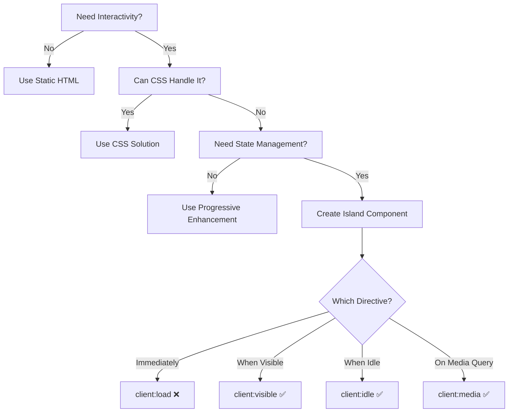

> 🏝️ **Purpose**: Strategic guide for adding interactivity to your Astro site while maintaining performance

## What is Islands Architecture?

Islands Architecture is a pattern where you ship mostly static HTML with "islands" of interactivity. Instead of hydrating an entire page (like traditional SPAs), you only hydrate specific components that need JavaScript.

**Key Principle**: Start with zero JavaScript, add interactivity only where it provides clear user value.

## When to Use Islands

### ✅ Good Use Cases

1. **Complex User Interactions**
    - Interactive forms with real-time validation
    - Data visualization dashboards
    - Rich text editors
    - Shopping carts with dynamic updates

2. **State Management Needs**
    - User preferences that persist
    - Multi-step forms
    - Real-time collaborative features
    - Complex filtering/sorting

3. **Third-Party Integrations**
    - Chat widgets
    - Analytics that require client-side tracking
    - Payment processors
    - Social media embeds

### ❌ Bad Use Cases

1. **Simple Interactions**
    - Basic navigation (use View Transitions)
    - Hover effects (use CSS)
    - Accordions (use `details`/`summary`)
    - Image galleries (use CSS scroll-snap)

2. **One-Time Actions**
    - Form submissions (use native forms)
    - Theme toggles (use CSS + minimal JS)
    - Copy to clipboard (progressive enhancement)

3. **Content Display**
    - Static content rendering
    - Blog posts
    - Marketing pages
    - Documentation

## Decision Framework



## Implementation Patterns

### 1. Progressive Enhancement First

```astro
<!-- ❌ Bad: JavaScript required for basic functionality -->
<div id="menu" class="hidden">
  <nav>...</nav>
</div>
<button onclick="toggleMenu()">Menu</button>

<!-- ✅ Good: Works without JavaScript -->
<details>
  <summary>Menu</summary>
  <nav>...</nav>
</details>

<!-- Enhance with JS if available -->
<script>
  // Add smooth animations, keyboard shortcuts, etc.
  const details = document.querySelector('details');
  if (details) {
    // Enhancement code
  }
</script>
```

### 2. Choosing the Right Client Directive

**Policy Note**: The `client:load` directive should be used sparingly as it loads JavaScript immediately and can impact performance. Its use must be justified as per [ADR-001: Preact Island Usage Policy and `client:load` Justification](/adr/001-preact-island-usage-policy/). Prefer `client:idle` or `client:visible` whenever possible.

```astro
---
// ❌ Bad: Loading immediately when not needed
import Counter from './Counter.tsx';
---
<Counter client:load />
```

```astro
---
// ✅ Good: Load when user will likely interact
import Counter from './Counter.tsx';
---
<Counter client:visible />
```

```astro
---
// ✅ Better: Load during idle time
import Counter from './Counter.tsx';
---
<Counter client:idle />
```

```astro
---
// ✅ Best: Load only on larger screens where it's used
import InteractiveChart from './Chart.tsx';
---
<InteractiveChart client:media="(min-width: 768px)" />
```

Exactly **one** `client:*` directive per component — Astro rejects a component that carries two (for example `client:visible client:only`).

### 3. Minimal Island Components

```tsx
// ❌ Bad: Entire page as a single island
export function ProductPage({ products }) {
  return (
    <div>
      <Header />
      <Filters onFilter={...} />
      <ProductGrid products={products} />
      <Cart />
      <Footer />
    </div>
  );
}

// ✅ Good: Only interactive parts as islands
// Static shell in Astro:
---
import Header from './Header.astro';
import ProductGrid from './ProductGrid.astro';
import FilterIsland from './FilterIsland.tsx';
import CartIsland from './CartIsland.tsx';
---

<Header />
<FilterIsland client:visible />
<ProductGrid products={...} />
<CartIsland client:idle />
<Footer />
```

## Island Performance Budgeting

### 1. Island Analysis Table

| Island | Component Size | Dependencies | Total JS | Load Time | User Value |
| :--- | :--- | :--- | :--- | :--- | :--- |
| **Search** | 5KB | 15KB (Fuse.js) | **20KB** | `idle` | Critical |
| **Theme Toggle** | 1KB | 0KB | **1KB** | `idle` | Enhancement |
| **Comments** | 10KB | 25KB (React) | **35KB** | `visible` | Nice-to-have |
| **Ad Banner** | 2KB | 50KB (Ad SDK) | **52KB** | `visible` | Low |

### 2. Defining the Budget

```typescript
// Define your island performance budget
interface IslandAnalysis {
  componentSize: number;      // Size of component code
  dependencySize: number;     // Size of dependencies
  totalSize: number;          // Total JavaScript added
  loadTime: 'immediate' | 'deferred' | 'lazy';
  userValue: 'critical' | 'enhancement' | 'nice-to-have';
}

// Example analysis
const searchIsland: IslandAnalysis = {
  componentSize: 5,         // 5KB component
  dependencySize: 15,       // 15KB (Fuse.js)
  totalSize: 20,           // 20KB total
  loadTime: 'lazy',        // Loads on interaction
  userValue: 'critical'    // High value feature
};
```

### 3. Measuring Performance

The mechanism below is **illustrative** — none of the starter's shipped islands (`src/components/islands/`) record marks today. The approach is a single User Timing convention: each island calls `performance.mark()` when it finishes mounting, and a page-level observer reads those marks. The same convention powers the `IslandMonitor` example under [Performance Monitoring](#performance-monitoring).

```tsx
// Inside a Preact island — record a mark once mounted
import { useEffect } from 'preact/hooks';

export function Counter() {
  useEffect(() => {
    // Marks are relative to navigation start, so `startTime` IS time-to-hydration.
    performance.mark('island:counter:hydrated');
  }, []);
  // ...
}
```

```astro
<script>
  // Observe island marks as they land (dev only)
  if (import.meta.env.DEV) {
    new PerformanceObserver((list) => {
      for (const entry of list.getEntries()) {
        if (entry.name.startsWith('island:')) {
          console.log('Hydrated:', entry.name, `${Math.round(entry.startTime)}ms`);
        }
      }
    }).observe({ type: 'mark', buffered: true });
  }
</script>
```

## Common Island Patterns

### 1. Search Island

```astro
---
// SearchIsland.astro - Progressive enhancement approach
---
<!-- Works without JavaScript -->
<form action="/search" method="get" class="search-form">
  <input 
    type="search" 
    name="q" 
    placeholder="Search..."
    value={Astro.url.searchParams.get('q')}
  />
  <button type="submit">Search</button>
</form>

<!-- Enhance with client-side search -->
<div id="search-results" class="hidden"></div>

<script>
  const form = document.querySelector('.search-form');
  const results = document.getElementById('search-results');
  
  if (form && results) {
    form.addEventListener('submit', async (e) => {
      e.preventDefault();
      const formData = new FormData(form);
      const query = formData.get('q');
      const response = await fetch(`/api/search?q=${query}`);
      const data = await response.json();
      results.innerHTML = data.map(item => `<div>...</div>`).join('');
      results.classList.remove('hidden');
    });
  }
</script>
```

### 2. Filter Island

```tsx
// FilterIsland.tsx - Only hydrate when visible
import { useState, useEffect } from 'preact/hooks';

export function FilterIsland({ initialFilters }) {
  const [filters, setFilters] = useState(initialFilters);
  
  // Update URL without navigation
  useEffect(() => {
    const params = new URLSearchParams(filters);
    window.history.replaceState(null, '', `?${params.toString()}`);
  }, [filters]);

  // Fetch new results when filters change
  useEffect(() => {
    // Fetch logic here
  }, [filters]);

  return (
    <form>
      {/* Filter controls */}
    </form>
  );
}
```

### 3. Comments Island

```astro
---
// CommentsSection.astro
import CommentsIsland from './Comments.tsx';
---

<section>
  <h3>Comments</h3>
  
  <!-- Skeleton loader -->
  <div class="skeleton-comments">
    <p>Loading comments...</p>
  </div>
  
  <!-- Actual comments component — one directive only. Use client:only="preact"
       instead of client:visible if the component cannot render on the server. -->
  <CommentsIsland 
    postId={post.id} 
    client:visible
  />
</section>
```

## Anti-Patterns to Avoid

### 1. ❌ Over-Hydration

```astro
<!-- Bad: Making entire sections interactive -->
<BlogPost client:load>
  <Content />
  <Comments />
  <RelatedPosts />
</BlogPost>

<!-- Good: Only interactive parts -->
<article>
  <Content />
  <CommentsIsland client:visible />
  <RelatedPosts />
</article>
```

### 2. ❌ Prop Drilling into Islands

```astro
<!-- Bad: Passing complex server data -->
<UserInfo client:load data={veryLargeUserObject} />

<!-- Good: Fetch data on the client -->
<UserInfo client:load userId={user.id} />

<script>
  // UserInfo.tsx fetches its own data
  useEffect(() => {
    fetch(`/api/users/${userId}`).then(...);
  }, [userId]);
</script>
```

### 3. ❌ Global State Pollution

```astro
<!-- Bad: Relying on global window objects -->
<script>
  window.theme = 'dark';
</script>
<ThemeToggle client:idle />

<!-- Good: Use stores or custom events -->
<script>
  // themeStore.js
  import { atom } from 'nanostores';
  export const theme = atom('light');
</script>

<ThemeToggleIsland client:idle />
<!-- Island uses window.themeManager -->
```

## Testing Islands

### 1. Performance Testing

```typescript
// tests/island-performance.test.ts
import { test, expect } from '@playwright/test';

test.describe('Island Performance', () => {
  test('islands load within performance budget', async ({ page }) => {
    const metrics = [];
    
    // Capture performance entries
    page.on('console', msg => {
      if (msg.text().includes('Hydration time:')) {
        metrics.push(JSON.parse(msg.text().split(':')[1]));
      }
    });

    await page.goto('/');
    
    // Assert performance budget
    for (const metric of metrics) {
      expect(metric.time).toBeLessThan(100); // 100ms budget
    }
  });
});
```

### 2. Hydration Testing

```typescript
// tests/hydration.test.ts
test('islands hydrate when expected', async ({ page }) => {
  await page.goto('/');
  
  // client:visible island shouldn't be hydrated yet
  const filterIsland = page.locator('[data-island="filters"]');
  await expect(filterIsland).not.hasAttribute('data-hydrated');
  
  // Scroll to it
  await filterIsland.scrollIntoViewIfNeeded();
  
  // Now it should be hydrated
  await expect(filterIsland).hasAttribute('data-hydrated');
});
```

## Refactoring Example

```tsx
// Before: Monolithic component
// app.tsx
export function App() {
  return (
    <>
      <Header />
      <Search />
      <Filters />
      <ProductGrid />
      <Cart />
      <Footer />
    </>
  );
}
```

```astro
---
// After: Only islands for interactive parts
// app.astro
import Header from './Header.astro';
import SearchIsland from './SearchIsland.tsx';
import FilterIsland from './FilterIsland.tsx';
import ProductGrid from './ProductGrid.astro';
import CartIsland from './CartIsland.tsx';
import Footer from './Footer.astro';
---

<Header />
<SearchIsland client:idle />
<div class="layout">
  <FilterIsland client:visible />
  <ProductGrid />
</div>
<CartIsland client:idle />
<Footer />
```

## Performance Monitoring

### Custom Island Metrics

Illustrative aggregator for the `island:<name>:hydrated` marks described in [Measuring Performance](#3-measuring-performance). It reads existing marks — it does not fabricate measurements — and re-runs after every `<ClientRouter />` navigation via `astro:page-load`.

```astro
---
// IslandMonitor.astro (illustrative — not shipped)
---

<script>
  document.addEventListener('astro:page-load', () => {
    for (const mark of performance.getEntriesByType('mark')) {
      if (mark.name.startsWith('island:')) {
        console.debug(`${mark.name} at ${Math.round(mark.startTime)}ms`);
      }
    }
  });
</script>
```

## Summary

Islands Architecture is about making thoughtful decisions about interactivity. Every island should earn its place by providing clear user value that justifies its JavaScript cost.

**Remember**: The best island is often no island at all. Start static, enhance progressively, and measure obsessively.
