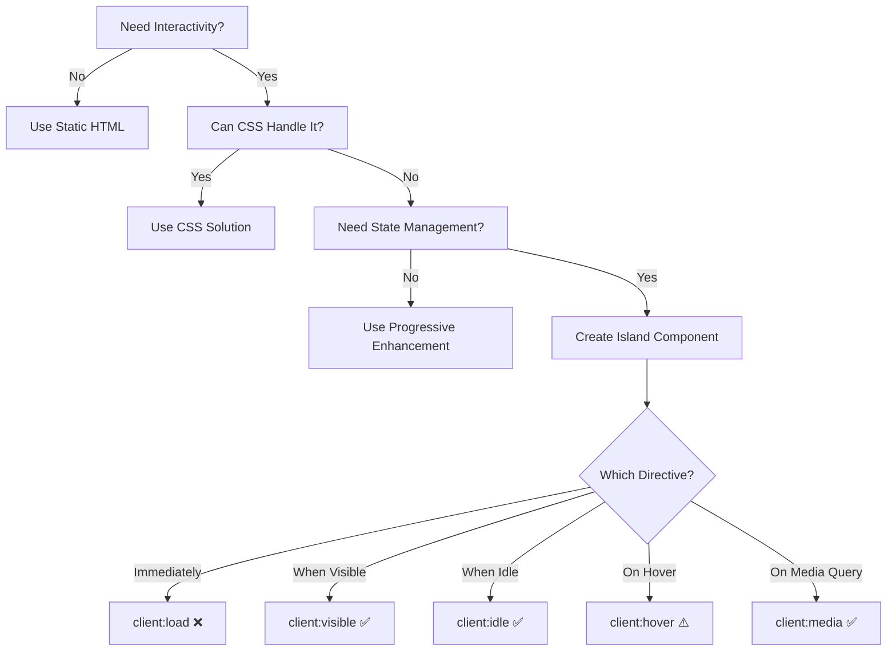

# Islands Architecture Pattern

> 🏝️ **Purpose**: Strategic guide for adding interactivity to your Astro site while maintaining performance

## What is Islands Architecture?

Islands Architecture is a pattern where you ship mostly static HTML with "islands" of interactivity. Instead of hydrating an entire page (like traditional SPAs), you only hydrate specific components that need JavaScript.

**Key Principle**: Start with zero JavaScript, add interactivity only where it provides clear user value.

## When to Use Islands

### ✅ Good Use Cases

1. **Complex User Interactions**
   - Interactive forms with real-time validation
   - Data visualization dashboards
   - Rich text editors
   - Shopping carts with dynamic updates

2. **State Management Needs**
   - User preferences that persist
   - Multi-step forms
   - Real-time collaborative features
   - Complex filtering/sorting

3. **Third-Party Integrations**
   - Chat widgets
   - Analytics that require client-side tracking
   - Payment processors
   - Social media embeds

### ❌ Bad Use Cases

1. **Simple Interactions**
   - Basic navigation (use View Transitions)
   - Hover effects (use CSS)
   - Accordions (use details/summary)
   - Image galleries (use CSS scroll-snap)

2. **One-Time Actions**
   - Form submissions (use native forms)
   - Theme toggles (use CSS + minimal JS)
   - Copy to clipboard (progressive enhancement)

3. **Content Display**
   - Static content rendering
   - Blog posts
   - Marketing pages
   - Documentation

## Decision Framework



## Implementation Patterns

### 1. Progressive Enhancement First

```astro
---
// ❌ Bad: JavaScript required for basic functionality
---
<div id="menu" class="hidden">
  <nav>...</nav>
</div>
<button onclick="toggleMenu()">Menu</button>

---
// ✅ Good: Works without JavaScript
---
<details>
  <summary>Menu</summary>
  <nav>...</nav>
</details>

<!-- Enhance with JS if available -->
<script>
  // Add smooth animations, keyboard shortcuts, etc.
  const details = document.querySelector('details');
  if (details) {
    // Enhancement code
  }
</script>
```

### 2. Choosing the Right Client Directive

**Policy Note**: The `client:load` directive should be used sparingly as it loads JavaScript immediately and can impact performance. Its use must be justified as per [ADR-001: Preact Island Usage Policy and `client:load` Justification](../adr/001-preact-island-usage-policy.md). Prefer `client:idle` or `client:visible` whenever possible.

```astro
---
// ❌ Bad: Loading immediately when not needed
import Counter from './Counter.jsx';
---
<Counter client:load />

---
// ✅ Good: Load when user will likely interact
import Counter from './Counter.jsx';
---
<Counter client:visible />

---
// ✅ Better: Load during idle time
import Counter from './Counter.jsx';
---
<Counter client:idle />

---
// ✅ Best: Load only on larger screens where it's used
import InteractiveChart from './Chart.jsx';
---
<InteractiveChart client:media="(min-width: 768px)" />
```

### 3. Minimal Island Components

```tsx
// ❌ Bad: Large component with everything interactive
export function ProductPage({ products }) {
  return (
    <div>
      <Header />
      <Filters onFilter={...} />
      <ProductGrid products={products} />
      <Cart />
      <Footer />
    </div>
  );
}

// ✅ Good: Only interactive parts as islands
// Static shell in Astro:
---
import Header from './Header.astro';
import ProductGrid from './ProductGrid.astro';
import FilterIsland from './FilterIsland.jsx';
import CartIsland from './CartIsland.jsx';
---

<Header />
<FilterIsland client:visible />
<ProductGrid products={products} />
<CartIsland client:idle />
<Footer />
```

### 4. Sharing State Between Islands

```astro
---
// Using nanostores for lightweight state sharing
import { atom } from 'nanostores';
---

<script>
  // Global state store
  import { atom } from 'nanostores';
  
  export const cartItems = atom([]);
  export const userPreferences = atom({
    theme: 'light',
    language: 'en'
  });
</script>

<!-- Island 1: Cart Display -->
<CartDisplay client:visible />

<!-- Island 2: Add to Cart Button -->
<AddToCartButton productId="123" client:idle />

<!-- Both islands can import and use the same store -->
```

## Performance Impact Analysis

### Bundle Size Considerations

```typescript
// Analyze before adding an island
interface IslandAnalysis {
  componentSize: number;      // Size of component code
  dependencySize: number;     // Size of dependencies
  totalSize: number;          // Total JavaScript added
  loadTime: 'immediate' | 'deferred' | 'lazy';
  userValue: 'critical' | 'enhancement' | 'nice-to-have';
}

// Example analysis
const searchIsland: IslandAnalysis = {
  componentSize: 5,         // 5KB component
  dependencySize: 15,       // 15KB (Fuse.js)
  totalSize: 20,           // 20KB total
  loadTime: 'lazy',        // Loads on interaction
  userValue: 'enhancement', // Not critical
};

// Decision: Acceptable if search improves user experience significantly
```

### Measuring Island Impact

```astro
---
// Add performance marks around islands
---

<div data-island="search">
  <script>performance.mark('search-island-start');</script>
  <SearchIsland client:visible />
  <script>performance.mark('search-island-end');</script>
</div>

<script>
  // Measure island hydration time
  if ('PerformanceObserver' in window) {
    new PerformanceObserver((list) => {
      for (const entry of list.getEntries()) {
        if (entry.name.includes('-island-')) {
          console.log(`Island hydration: ${entry.duration}ms`);
          
          // Send to analytics
          if (window.gtag) {
            gtag('event', 'timing_complete', {
              name: 'island_hydration',
              value: Math.round(entry.duration),
              label: entry.name
            });
          }
        }
      }
    }).observe({ entryTypes: ['measure'] });
  }
</script>
```

## Common Island Patterns

### 1. Search Island

```astro
---
// SearchIsland.astro - Progressive enhancement approach
---

<!-- Works without JavaScript -->
<form action="/search" method="get" class="search-form">
  <input 
    type="search" 
    name="q" 
    placeholder="Search..."
    value={Astro.url.searchParams.get('q')}
  />
  <button type="submit">Search</button>
</form>

<!-- Enhance with JavaScript if available -->
<div id="search-results" class="hidden"></div>

<script>
  // Only enhance if JavaScript is available
  const form = document.querySelector('.search-form');
  const results = document.getElementById('search-results');
  
  if (form && results) {
    form.addEventListener('submit', async (e) => {
      e.preventDefault();
      
      const query = new FormData(form).get('q');
      const response = await fetch(`/api/search?q=${query}`);
      const data = await response.json();
      
      // Render results
      results.innerHTML = data.results
        .map(r => `<a href="${r.url}">${r.title}</a>`)
        .join('');
      results.classList.remove('hidden');
    });
  }
</script>
```

### 2. Filter Island

```tsx
// FilterIsland.tsx - Only hydrate when visible
import { useState, useEffect } from 'preact/hooks';

export function FilterIsland({ initialFilters }) {
  const [filters, setFilters] = useState(initialFilters);
  
  // Update URL without navigation
  useEffect(() => {
    const params = new URLSearchParams(filters);
    window.history.replaceState({}, '', `?${params}`);
  }, [filters]);
  
  return (
    <aside class="filters">
      {/* Filter UI */}
    </aside>
  );
}

// In Astro:
<FilterIsland 
  client:visible 
  initialFilters={Object.fromEntries(Astro.url.searchParams)}
/>
```

### 3. Cart Island

```tsx
// CartIsland.tsx - Load when idle
import { useStore } from '@nanostores/preact';
import { cartItems } from '@/stores/cart';

export function CartIsland() {
  const $cartItems = useStore(cartItems);
  
  return (
    <div class="cart-widget">
      <button>
        Cart ({$cartItems.length})
      </button>
      {/* Cart dropdown */}
    </div>
  );
}

// In Astro - placed in header
<CartIsland client:idle />
```

### 4. Comments Island

```astro
---
// Load comments only when user scrolls to them
---

<section id="comments">
  <h2>Comments</h2>
  
  <!-- Placeholder while loading -->
  <div class="comments-loading">
    <p>Loading comments...</p>
  </div>
  
  <!-- Actual comments component -->
  <CommentsIsland 
    postId={post.id} 
    client:visible
    client:only="preact"
  />
</section>
```

## Anti-Patterns to Avoid

### 1. ❌ Over-Hydration

```astro
<!-- Bad: Making entire sections interactive -->
<BlogPost client:load>
  <Content />
  <Comments />
  <RelatedPosts />
</BlogPost>

<!-- Good: Only interactive parts -->
<article>
  <Content />
  <CommentsIsland client:visible />
  <RelatedPosts />
</article>
```

### 2. ❌ Client-Side Data Fetching for Static Content

```tsx
// Bad: Fetching static content client-side
function BlogList() {
  const [posts, setPosts] = useState([]);
  
  useEffect(() => {
    fetch('/api/posts').then(r => r.json()).then(setPosts);
  }, []);
  
  return <div>{posts.map(...)}</div>;
}

// Good: Fetch at build time in Astro
---
const posts = await getCollection('blog');
---
<BlogList posts={posts} />
```

### 3. ❌ Duplicate Logic

```astro
<!-- Bad: Same logic in multiple places -->
<script>
  // Theme toggle logic
  function toggleTheme() { ... }
</script>

<ThemeToggleIsland client:load />
<!-- Island also has theme toggle logic -->

<!-- Good: Single source of truth -->
<script>
  // Shared theme logic
  window.themeManager = {
    toggle() { ... }
  };
</script>

<ThemeToggleIsland client:idle />
<!-- Island uses window.themeManager -->
```

## Testing Islands

### 1. Performance Testing

```typescript
// tests/island-performance.test.ts
import { test, expect } from '@playwright/test';

test.describe('Island Performance', () => {
  test('islands load within performance budget', async ({ page }) => {
    const metrics = [];
    
    // Capture performance entries
    page.on('console', msg => {
      if (msg.text().includes('Island hydration:')) {
        metrics.push(parseFloat(msg.text().match(/(\d+)ms/)[1]));
      }
    });
    
    await page.goto('/');
    await page.waitForTimeout(3000); // Wait for all islands
    
    // Check hydration times
    expect(Math.max(...metrics)).toBeLessThan(100); // No island over 100ms
  });
  
  test('page works without JavaScript', async ({ browser }) => {
    const context = await browser.newContext({
      javaScriptEnabled: false
    });
    const page = await context.newPage();
    
    await page.goto('/');
    
    // Core functionality should work
    await expect(page.locator('nav')).toBeVisible();
    await expect(page.locator('main')).toBeVisible();
    
    // Forms should submit
    await page.fill('input[type="search"]', 'test');
    await page.click('button[type="submit"]');
    await expect(page).toHaveURL(/search\?q=test/);
  });
});
```

### 2. Hydration Testing

```typescript
// tests/hydration.test.ts
test('islands hydrate when expected', async ({ page }) => {
  await page.goto('/');
  
  // client:visible island shouldn't be hydrated yet
  const filterIsland = page.locator('[data-island="filters"]');
  await expect(filterIsland).not.toHaveAttribute('data-hydrated');
  
  // Scroll to trigger hydration
  await filterIsland.scrollIntoViewIfNeeded();
  await page.waitForTimeout(500);
  
  // Should now be hydrated
  await expect(filterIsland).toHaveAttribute('data-hydrated', 'true');
});
```

## Migration Strategy

### From SPA to Islands

```typescript
// Step 1: Identify truly interactive components
const componentAudit = {
  Header: { interactive: false, reason: 'Only navigation' },
  SearchBar: { interactive: true, reason: 'Type-ahead search' },
  ProductGrid: { interactive: false, reason: 'Static display' },
  Filters: { interactive: true, reason: 'Dynamic filtering' },
  Cart: { interactive: true, reason: 'Add/remove items' },
  Footer: { interactive: false, reason: 'Static links' }
};

// Step 2: Extract static parts
// Before: Everything in React
export function App() {
  return (
    <>
      <Header />
      <SearchBar />
      <Filters />
      <ProductGrid />
      <Cart />
      <Footer />
    </>
  );
}

// After: Only islands for interactive parts
---
// app.astro
import Header from './Header.astro';
import SearchIsland from './SearchIsland.jsx';
import FilterIsland from './FilterIsland.jsx';
import ProductGrid from './ProductGrid.astro';
import CartIsland from './CartIsland.jsx';
import Footer from './Footer.astro';
---

<Header />
<SearchIsland client:idle />
<div class="layout">
  <FilterIsland client:visible />
  <ProductGrid />
</div>
<CartIsland client:load />
<Footer />
```

## Performance Monitoring

### Custom Island Metrics

```astro
---
// IslandMonitor.astro
---

<script>
  class IslandMonitor {
    constructor() {
      this.islands = new Map();
      this.observer = new PerformanceObserver(this.handleEntries.bind(this));
      this.observer.observe({ entryTypes: ['measure', 'element'] });
    }
    
    trackIsland(name, startMark, endMark) {
      performance.measure(`island-${name}`, startMark, endMark);
    }
    
    handleEntries(list) {
      for (const entry of list.getEntries()) {
        if (entry.name.startsWith('island-')) {
          const name = entry.name.replace('island-', '');
          this.islands.set(name, {
            duration: entry.duration,
            timestamp: entry.startTime,
            size: this.getIslandSize(name)
          });
          
          this.reportMetrics();
        }
      }
    }
    
    getIslandSize(name) {
      // Get the size of JavaScript loaded for this island
      const resources = performance.getEntriesByType('resource');
      const islandResources = resources.filter(r => 
        r.name.includes(name) && r.name.endsWith('.js')
      );
      
      return islandResources.reduce((sum, r) => sum + r.transferSize, 0);
    }
    
    reportMetrics() {
      const metrics = Array.from(this.islands.entries()).map(([name, data]) => ({
        island: name,
        hydrationTime: data.duration,
        jsSize: data.size,
        timestamp: data.timestamp
      }));
      
      // Send to analytics
      if (navigator.sendBeacon) {
        navigator.sendBeacon('/api/island-metrics', JSON.stringify(metrics));
      }
    }
  }
  
  // Initialize monitoring
  window.islandMonitor = new IslandMonitor();
</script>
```

### Dashboard for Island Performance

```astro
---
// src/pages/admin/islands-dashboard.astro
import BaseLayout from '@/layouts/BaseLayout.astro';
import { getIslandMetrics } from '@/lib/metrics';

const metrics = await getIslandMetrics();
---

<BaseLayout title="Islands Performance Dashboard">
  <div class="container py-8">
    <h1 class="text-3xl font-bold mb-8">Islands Performance</h1>
    
    <!-- Island Overview -->
    <div class="grid grid-cols-1 md:grid-cols-3 gap-6 mb-8">
      <div class="bg-white rounded-lg p-6">
        <h3 class="text-sm font-medium text-gray-500">Total Islands</h3>
        <p class="text-3xl font-bold">{metrics.totalIslands}</p>
      </div>
      
      <div class="bg-white rounded-lg p-6">
        <h3 class="text-sm font-medium text-gray-500">Avg Hydration Time</h3>
        <p class="text-3xl font-bold">{metrics.avgHydrationTime}ms</p>
      </div>
      
      <div class="bg-white rounded-lg p-6">
        <h3 class="text-sm font-medium text-gray-500">Total JS Size</h3>
        <p class="text-3xl font-bold">{metrics.totalJsSize}KB</p>
      </div>
    </div>
    
    <!-- Per-Island Metrics -->
    <div class="bg-white rounded-lg overflow-hidden">
      <table class="w-full">
        <thead class="bg-gray-50">
          <tr>
            <th class="px-6 py-3 text-left">Island</th>
            <th class="px-6 py-3 text-left">Load Strategy</th>
            <th class="px-6 py-3 text-left">Avg Hydration</th>
            <th class="px-6 py-3 text-left">JS Size</th>
            <th class="px-6 py-3 text-left">Usage</th>
          </tr>
        </thead>
        <tbody class="divide-y">
          {metrics.islands.map((island) => (
            <tr>
              <td class="px-6 py-4 font-medium">{island.name}</td>
              <td class="px-6 py-4">
                <span class={`px-2 py-1 text-xs rounded-full ${
                  island.strategy === 'load' ? 'bg-red-100 text-red-800' :
                  island.strategy === 'idle' ? 'bg-yellow-100 text-yellow-800' :
                  'bg-green-100 text-green-800'
                }`}>
                  client:{island.strategy}
                </span>
              </td>
              <td class="px-6 py-4">{island.avgHydration}ms</td>
              <td class="px-6 py-4">{island.jsSize}KB</td>
              <td class="px-6 py-4">{island.usage}%</td>
            </tr>
          ))}
        </tbody>
      </table>
    </div>
  </div>
</BaseLayout>
```

## Best Practices Checklist

### Before Adding an Island

- [ ] Can this be done with CSS only?
- [ ] Does it work without JavaScript?
- [ ] Is the interaction critical to user experience?
- [ ] Have I measured the JavaScript cost?
- [ ] Is there a lighter alternative?

### Island Implementation

- [ ] Using the most appropriate client directive
- [ ] Component is as small as possible
- [ ] Dependencies are tree-shakeable
- [ ] State management is lightweight
- [ ] Fallback behavior implemented

### Performance Validation

- [ ] Hydration time < 100ms
- [ ] JavaScript size < 50KB per island
- [ ] No layout shift during hydration
- [ ] Works on slow connections
- [ ] Tested with JavaScript disabled

## Advanced Patterns

### 1. Conditional Islands

```astro
---
// Only load island for certain conditions
const shouldLoadChat = Astro.cookies.get('user')?.value;
---

{shouldLoadChat && (
  <ChatIsland 
    userId={Astro.cookies.get('user').value} 
    client:only="preact"
  />
)}
```

### 2. Island Composition

```astro
---
// Compose multiple small islands instead of one large one
---

<div class="dashboard">
  <MetricsIsland client:visible />
  <ChartsIsland client:media="(min-width: 1024px)" />
  <FiltersIsland client:idle />
  <ExportIsland client:hover />
</div>
```

### 3. Island Communication

```typescript
// Using custom events for island communication
// Island A
function FilterIsland() {
  const updateFilters = (filters) => {
    window.dispatchEvent(new CustomEvent('filters-changed', { 
      detail: filters 
    }));
  };
}

// Island B
function ResultsIsland() {
  useEffect(() => {
    const handleFilters = (e) => {
      // Update results based on filters
    };
    
    window.addEventListener('filters-changed', handleFilters);
    return () => window.removeEventListener('filters-changed', handleFilters);
  }, []);
}
```

## Framework-Specific Considerations

### Preact Islands

```tsx
// Use Preact for smaller bundle size
import { h } from 'preact';
import { useState } from 'preact/hooks';

// Lazy load heavy dependencies
const ChartLibrary = lazy(() => import('chart-library'));
```

### Vue Islands

```vue
<!-- Use petite-vue for tiny islands -->
<div v-scope="{ count: 0 }">
  <button @click="count++">{{ count }}</button>
</div>

<script>
import { createApp } from 'petite-vue';
createApp().mount();
</script>
```

### Svelte Islands

```svelte
<!-- Svelte already has small runtime -->
<script>
  export let initialCount = 0;
  let count = initialCount;
</script>

<button on:click={() => count++}>
  Clicks: {count}
</button>
```

## Debugging Islands

### Development Tools

```javascript
// Add to development builds only
if (import.meta.env.DEV) {
  window.__ISLAND_DEBUG__ = {
    listIslands() {
      return document.querySelectorAll('[data-island]');
    },
    
    getIslandStats(name) {
      const island = document.querySelector(`[data-island="${name}"]`);
      return {
        hydrated: island?.hasAttribute('data-hydrated'),
        size: island?.innerHTML.length,
        strategy: island?.getAttribute('data-strategy')
      };
    },
    
    forceHydrate(name) {
      const island = document.querySelector(`[data-island="${name}"]`);
      island?.dispatchEvent(new Event('force-hydrate'));
    }
  };
}
```

## Summary

Islands Architecture is about making thoughtful decisions about interactivity. Every island should earn its place by providing clear user value that justifies its JavaScript cost.

**Remember**: The best island is often no island at all. Start static, enhance progressively, and measure obsessively.