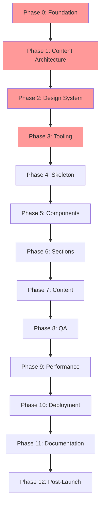

<Badge variant="success">Done</Badge>

## Quick Start

This guide provides a structured approach to building high-performance Astro sites with two implementation tracks:

* **MVP Track**: Fast, focused delivery with essential features
* **Showcase Track**: Advanced implementation demonstrating technical excellence

## Phase Dependency Map

**Legend**: 🔴 Foundation (Immutable) | 🟡 Structure | 🟢 Implementation | 🔵 Quality | ⚫ Deployment

## Implementation Tracks

### MVP Track

* **Goal**: Ship a performant, accessible site as quickly as possible
* **Focus**: Content presentation, zero JavaScript, essential features
* **Best For**: Portfolios, blogs, marketing sites

### Showcase Track

* **Goal**: Demonstrate advanced technical capabilities
* **Focus**: Component architecture, testing, advanced patterns
* **Best For**: Technical portfolios, team projects, enterprise sites

[See detailed track comparison →](/implementation-guides/tracks/track-comparison/)

## Phase Overview

| Phase | Name | MVP | Showcase | Effort | Critical Path |
|-------|------|-----|----------|----------|---------------|
| 0 | [Foundation](/implementation-guides/01-foundation-phase-0-foundation/) | Full | Full | Low | ✅ |
| 1 | [Content Architecture](/implementation-guides/01-foundation-phase-1-content-arch/) | Full | Full | 1-2 days | ✅ |
| 2 | [Design System](/implementation-guides/01-foundation-phase-2-design-system/) | Full | Full | 1-2 days | ✅ |
| 3 | [Tooling](/implementation-guides/01-foundation-phase-3-tooling/) | Full | Full | 1 day | ✅ |
| 4 | [Skeleton](/implementation-guides/02-structure-phase-4-skeleton/) | Full | Full | Moderate | ⚡ |
| 5 | [Components](/implementation-guides/02-structure-phase-5-components/) | Lite | Full | 2-4 days | ⚡ |
| 6 | [Sections](/implementation-guides/02-structure-phase-6-sections/) | Lite | Full | 2-3 days | ⚡ |
| 7 | [Content](/implementation-guides/03-content-phase-7-content/) | Full | Full | 3-5 days | 📝 |
| 8 | [QA](/implementation-guides/04-quality-phase-8-qa/) | Lite | Full | 1-3 days | ✓ |
| 9 | [Performance](/implementation-guides/04-quality-phase-9-performance/) | Full | Full | 1-2 days | ✓ |
| 10 | [Deployment](/implementation-guides/05-deployment-phase-10-deployment/) | Full | Full | 1 day | 🚀 |
| 11 | [Documentation](/implementation-guides/05-deployment-phase-11-documentation/) | Lite | Full | 1-2 days | 📚 |
| 12 | [Post-Launch](/implementation-guides/05-deployment-phase-12-post-launch/) | Lite | Full | 1 day | 🎯 |

## Getting Started

1. **Choose Your Track**: Review [track comparison](/implementation-guides/tracks/track-comparison/)
2. **Review Tech Stack**: Check [technology choices](/implementation-guides/tech-stack/)
3. **Understand Budgets**: Study [performance targets](/implementation-guides/budgets-guardrails/)
4. **Set Up Structure**: Follow [directory layout](/implementation-guides/directory-structure/)
5. **Begin Phase 0**: Start with [foundation decisions](/implementation-guides/01-foundation-phase-0-foundation/)

## For AI Assistants

When working with AI assistants:

1. Start with [AI Context Index](/implementation-guides/ai-context/INDEX/)
2. Reference specific phase documents as needed
3. Use [prompt templates](/implementation-guides/ai-context/prompt-templates/) for common tasks
4. Keep context updated with [maintenance guide](/implementation-guides/ai-context/context-updates/)

## Common Patterns

* [Islands Architecture](/implementation-guides/patterns/islands-architecture/) - When to add interactivity
* [Content Collections](/implementation-guides/patterns/content-collections/) - Advanced content patterns
* [Performance Patterns](/implementation-guides/patterns/performance-patterns/) - Optimization techniques
* [Component Patterns](/implementation-guides/patterns/component-patterns/) - Reusable UI patterns

## Quick Decision Matrix

| Need | MVP Choice | Showcase Choice |
|------|------------|-----------------|
| Interactivity | Static HTML + CSS | Islands where justified |
| Testing | Manual checklist | Playwright + Visual |
| Components | Essential only | Full library + Astrobook |
| Documentation | README + basics | Comprehensive guides |
| Monitoring | Basic uptime | RUM + Error tracking |

## Support & Updates

* **Changelog**: [CHANGELOG.md](/CHANGELOG/)
* **Issues**: Create an issue in your project repo
* **Updates**: Check monthly for Astro updates
* **Community**: [Astro Discord](https://astro.build/chat)
